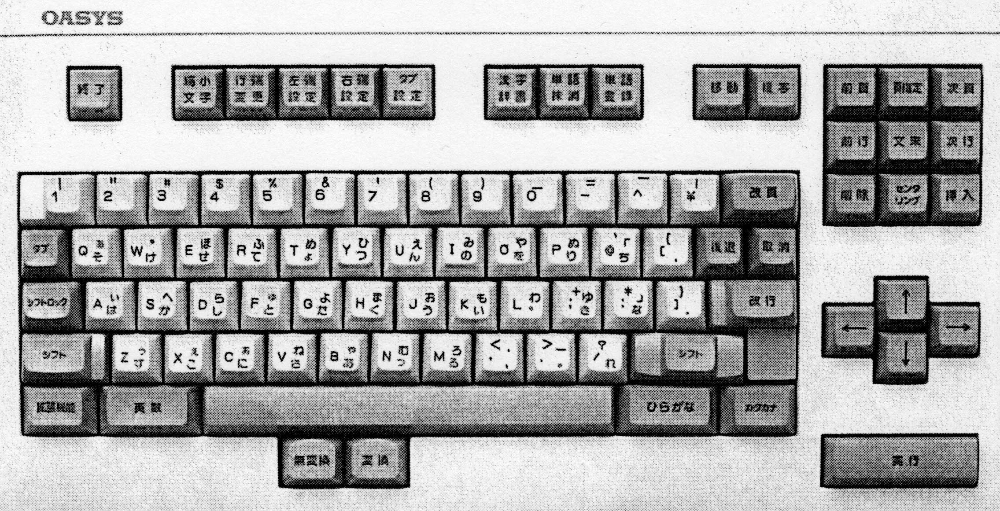

# RISCかな配列の設計

## はじめに

本稿の筆者は本稿において、タッチパネル上ではない物理的なキーボード用に、いわゆる「ローマ字入力」を改良した日本語かな配列として、
**RISCかな配列**を提案する。本稿では、RISCかな配列の内容とともに、その背景と設計手法も述べる。

RISCかな配列は、ローマ字の規則性を廃して学習コストを増やすかわりに打鍵コストを減らすことを目指して設計された。
かな漢字変換が備えるローマ字テーブルのカスタマイズ機能だけで実装できる、ラテン文字キーだけで打てる（読点を除く）、という特徴もある。

RISCかな配列は、いわゆる「ローマ字入力」に比べて、単位時間あたりのかな文字入力数を50%多くできる可能性がある。

RISCかな配列は数理最適化（組合せ最適化）を用いて設計された。

RISCかな配列を用いる人への案内は、[RISCかな配列 Wikiホーム](https://github.com/hajimen/risc-kana-layout/wiki)にある。
設計に用いたツールは[本稿のリポジトリ](https://github.com/hajimen/risc-kana-layout)にある。

## 背景

本章では、日本語文章の計算機への入力方法について、過去の事例や前提条件を検討する。

2024年現在、計算機で日本語文章を処理する際には、Unicodeを用いた漢字かな交じり文での表現が広く用いられている。
本稿はこの表現方法のみを扱う。計算機で日本語文章を処理する方法には他に、PCMなどで符号化された音声、
2次元の画像、漢字とひらがながなくカタカナだけを持つ文字コード（JIS X 0201[^JISX0201]等）、などもよく用いられているが、
本稿では扱わない。

[^JISX0201]: いわゆる半角カナと、円記号/バックスラッシュ・チルダ/オーバーライン問題の根源となった規格

本稿で扱う日本語文章をキーボードで入力する際には、**かな漢字変換**を用いることがほとんどである。
RISCかな配列もかな漢字変換の使用を想定している。漢字直接入力などについては本稿では論じない。

現在、ローマ字での入力を「かな入力」とは呼ばないことが一般的だが、本稿ではローマ字もかな配列に含める。
いわゆる「ローマ字入力」はすべて、かな文字列を経由し、かな文字列が漢字に変換されている。
入力（打鍵列）と出力（かな文字列）の関係は固定されており、配列といってよい。
いわゆる「ローマ字入力」のことを、以下では**ローマ字かな配列**と呼ぶ。

現在のキーボードは、スマホやタブレットなどのタッチパネル上のキーボード（スクリーンキーボード）が利用の大半を占めるが、
本稿では物理的なキーボードのみを扱う。

### 物理的な配列

本稿は物理的な配列として以下の3種類を主に想定する：

- OADG配列とその派生物
- IBM Model M US配列とその派生物
- IBM Model M ISO配列とその派生物

2024年現在、この3種類のどれでもない物理的な配列は、自作キーボードなどの稀なものである。

RISCかな配列は、かな漢字変換の**ローマ字テーブル**のカスタマイズ機能だけを用いて実装するので、
キーの作用は**キートップ**（キーキャップ上面）の印刷どおりになる。
本稿では、キートップの印刷とその作用も物理的な配列に含める。

### 文字キー、機能キー、修飾キー

本稿はかな漢字変換として主に**Google日本語入力**を想定する。
2024年現在、Google日本語入力はかな漢字変換の圧倒的なシェアを占めているためである。

2024年12月現在、Google日本語入力は、**文字キー**、**機能キー**、**修飾キー**を区別する。
すなわち、文字キーや修飾キー（の空打ち）に【確定】【変換】などの機能を割り当てるカスタマイズができない。
このため本稿においても、これらの区別を行う。

個々のキーの分類は、2024年12月現在のGoogle日本語入力の実装に従う。
【確定】【変換】などの機能を割り当てられるキーが機能キー、ローマ字テーブルに入力として定義できるのが文字キー、
どちらでもないのが修飾キーである。この機能キーの定義により、本稿ではスペースキーを機能キーとして扱う。
また本稿ではテンキー部分は扱わない。

また修飾キーはキーボードの左右にあることが多いが、Google日本語入力が左右を区別しないので、本稿も区別しない。
すなわち、「右シフトキー」ではなく「シフトキー」とする。

文字キーは、**ラテン文字キー**と**記号キー**に分ける。ラテン文字の打鍵として作用する26個のキーがラテン文字キー、
それ以外が記号キーである。

### かな文字の個数

Unicode 15.0ではHiraganaブロックに93個のコードポイントが割り当てられている。
単独や合成用の濁点・半濁点を除くと89個、逆に濁音・半濁音の文字を除いて単独の濁点・半濁点を残すと64個、
ここから小書き文字を除いて単独の小書きを加えると53個、さらに「ゐ・ゑ・ゝ・ゟ」の4個を外すと49個となる。

（「単独の小書き」はUnicodeに存在しない概念だが、かな配列を記述するうえで有用である。単独の濁点
（゛ KATAKANA-HIRAGANA VOICED SOUND MARK U+309B）や半濁点と同様、他の打鍵列を修飾して小書き文字を出力させる打鍵列である。
たとえばローマ字かな配列では、LやXが単独の小書きとして前置され、直後の出力を小書き文字にする）

現在のiOS・Androidでは、小書き文字が小書きでない、濁音・半濁音の文字が清音、といった、
現代日本語としてはイレギュラーな入力に対応したかな漢字変換が一般的である。
かな漢字変換の入力の文字個数は46個が下限とみてよい。
しかし46個では、かな漢字変換を作用させない、いわゆる【無変換】での入力に支障がある。
かな配列が打てるべき文字個数の下限は49個とすべきだろう。

単独の濁点・半濁点や単独の小書きは、日本語としては文字にならないが、以下では**かな文字**に含める。

多くの既存のかな配列が、日本語に頻出する記号を備えている。なかでもJIS X 0201に含まれる：

- 音引き ー KATAKANA-HIRAGANA PROLONGED SOUND MARK U+30FC
- 句読点 、。 IDEOGRAPHIC COMMAとIDEOGRAPHIC FULL STOP U+3001とU+3002
- 中黒 ・ KATAKANA MIDDLE DOT U+30FB
- かぎ括弧 「」 LEFT CORNER BRACKETとRIGHT CORNER BRACKET U+300CとU+300D

の6個（以下これを**JIS X 0201記号**と呼ぶ）は、多くのかな配列が備えている。以下ではこれらもかな文字に含める。

Unicode 15.0のHiraganaブロックには小書き文字が12個ある（「ぁぃぅぇぉゃゅょっゎゕゖ」）。
このうち「ゎゕゖ」以外の9個はJIS X 0201に含まれており、特別な地位にある。
以下この9個を**JIS X 0201小書き文字**と呼ぶ。

### 旧JIS配列と親指シフト

日本国内で現在一般的なキーボードの物理的な配列（OADG配列とその派生物）では、
テンキーを除いた文字キー（スペースキーを含まない）が48個ある。
この48個とシフトキーの合計49個にかな文字を対応させたのが、
**旧JIS配列**[^JISX6002]である。シフトキーを単独の小書きとし、
またシフトキーを「を」とJIS X 0201記号の出力にも併用することで、
前節でみた下限49個とJIS X 0201記号6個の合計55個を、49個のキーに押し込んだ設計といえる。

[^JISX6002]: JIS X 6002

旧JIS配列に対する批判は古く1970年代[^JISC6233]からあり、**親指シフト**（1980年発売）はその最初の具現化といえる。
現在、ローマ字かな配列のシェアが旧JIS配列を圧倒しているのも、旧JIS配列に対する批判の具現化といえる。

[^JISC6233]: 当時はJIS C 6233、1972年制定

親指シフトの設計思想には、現在でも重要な点が2つある：

1. 電気スイッチのキーボードを用いたときの**打鍵コスト**（後述）が小さい
2. 業務で利用できるようになるまでの学習コスト（以下これを「**最小学習コスト**」と呼ぶ）が小さい

旧JIS配列の源流となる配列が設計された当時、電動タイプライターは存在しなかった。手動タイプライターは、
打鍵に力がいることはもちろん、その強さが一定でなければならない。さもないと文字の太さが不均一になる。
このため、手動タイプライターの打ちやすさ・打ちにくさを構成する要素は、電気スイッチのキーボードのそれとは根本的に異なる。
旧JIS配列が電気スイッチのキーボードで打ちづらいのは当然といえる。

（ちなみに、IBM Selectricのような典型的な電動タイプライター electric typewriter の仕組みも、電気スイッチのキーボードとはまったく異なる。
電気スイッチのキーボードを使ったタイプライターは電子タイプライター electronic typewriter と呼ぶことが多い）

他方、親指シフト設計当時のキーボードは、現在のそれと比べて、手動タイプライターほどには違わない。
今日まで、親指シフトの派生物というべきかな配列が数多く生み出されてきたのは、この共通性によるところが大きい。
ただし、1990年以前の実験結果は2016年には再現できなかった、とする研究報告がある（後述）。両者の違いは無視できるほどには小さくない。

親指シフトは、入力の速度とコストだけを追求した配列ではない。入力の速度とコストだけを追求した事例に、ステノワードがある。
ステノワードは、かなを経由することなく、暗号的な短い打鍵列で辞書を引くことで長い語句を出力する。
打鍵列と語句の対応を1,000個以上も暗記する必要があるため、その最小学習コストは、親指シフトに比べて桁違いに大きい。

親指シフトのキーボードのキートップには、かな文字が印刷されている。親指シフトとその派生物を見慣れていると気づかないが、
最小学習コストを小さくするための重要な工夫と制約がここにある。
配列の暗記が不完全でも、キーボードを見て文字を探せば入力できるのだ。ローマ字かな配列では、もしローマ字の暗記が不完全なら、
ローマ字表を見るしかない。

しかしキートップへの文字印刷は、重大な制約をもたらしている。すなわち：

- キーとかな文字列の**1対 $N$ 対応**において、 $N$ は最大3
- $N$ のうちどれを選択するかは、なんらかの**シフト**で決まる

というものだ。 $N \geqq 4$ では、キートップにかな文字を印刷しても、文字が小さすぎて判読が難しい
（ラテン文字を省けないので $N=3$ で4文字となる。ただし管見の限り、ラテン文字をキートップに並べた
$N = 3$ のかな配列が大量生産された例はない）。親指シフトの派生物はすべて、なんらかのシフトを用いている。

### シフト問題と文字印刷問題

親指シフトは多くの派生物を生んだ。**新JIS配列**[^JISX6004]はその最初期のものである。
親指シフトと同様に、きわめて打ちやすいシフトキーを必要とする配列だったが、新JIS配列を採用したワープロ専用機はすべて、
現在一般的なキーボードと同じ位置で済ませた。設計上の意図としてはそれでも十分のはずだったが、新JIS配列の使用経験者の証言は異なる。
これが**シフト問題**である。

[^JISX6004]: JIS X 6004、1985年発表、翌年制定

（ただし、多くの新JIS配列キーボードのシフトキーが、スタビライザーのない表彰台型キーだったことには注意を促したい。
表彰台型キーは打ちにくい。管見の限り、富士通とシャープは表彰台型キーで、スタビライザーつきはキヤノンのみである。下の写真は
[『最新ワープロ大百科』（1987-1995年）](https://ndlsearch.ndl.go.jp/books/R100000002-I000000054194)
'88前期版141ページから引用）

シフト問題への対応として、**中指前置シフト**（1989年発表）がある。これは発表当時にはほとんど関心を集めなかったが、
のちに**月配列**（2002年から）というムーブメントを起こした。

中指前置シフトは、かな漢字変換のローマ字テーブルのカスタマイズ機能を活用することで、シフトキーの位置問題を解決した。
その解決策とは、文字キーのうち打ちやすい位置の2つを選んで前置シフトとする、というものである。
たとえば、"j"に「う」、"dj"に「お」、"i"に「い」、"di"に「み」という具合にローマ字テーブルを作成する。
これでDが前置シフトとして働く。

しかし、月配列やその派生物のかな文字を印刷したキーボードが大量生産されたことはない。
前節でみたように、シフトを用いる・キートップに文字を印刷する・最小学習コストが小さい、
の3点セットは親指シフトの三本柱である。柱の一本を欠くのなら、シフトと1対 $N$ 対応（ $N \leqq 3$ ）を採用するメリットは薄れ、デメリットが残る。
入力したいかな文字を、規則性のない配列表のなかから探すより、五十音順で打鍵列が書いてある表を見るほうが速い。

最小学習コストの想定環境も、親指シフト時代から変わった。ワープロ専用機の全盛期には、日本語だけ入力するのでQWERTY配列を覚えない、
というユーザのほうが多かった。その場合、打鍵列が五十音順に並べてある表を見ても、その打鍵列がラテン文字で書いてあるのでは、
結局キーボードを見て探すしかない。しかし現在では、QWERTY配列を覚えていないユーザを想定すべきケースは稀である。

出せるかな文字列の個数の少なさも、 $N \leqq 3$ がもたらす問題である。どんな配列でも、配列である以上、キーとかな文字列は最終的に1対 $N$ 対応となる。
ローマ字かな配列も、母音キー（AIUEO）が出す文字列をその直前の子音キー打鍵列で選ぶとみなすなら、1対 $N$ 対応といえる。
その $N$ は20以上、出力の個数は130以上ある。それゆえローマ字かな配列は単独の濁音・半濁音を要さないし、長さ2のかな文字列を出せる。
日本語における「が」「で」の頻度は約2%前後、「ど」「じ」「だ」は約1%ある。「しょ」「しゅ」は約0.5%、
「じょ」「きょ」「しゃ」「ちょ」「じゅ」「りょ」は0.2%以上の頻度で現れ、頻度順で上位70位以内となる。ちなみに「ゆ」の頻度は0.21%である。

2つ前の節でみたように、かな配列が打てるべきかな文字列個数の下限は49個、JIS X 0201記号を含めると55個である。
旧JIS配列はこの55個を49個のキー（シフトキーを含む）に押し込んだ。親指シフトとその派生物では、
単独の小書きを外してJIS X 0201小書き文字9個を入れた63個（親指シフトは仔細あるが省略）をターゲットとし、
打ちにくい数字段を外して、33から36個のキー（シフトキーを含む）に押し込んだ。
つまり、用いるキー数が減らされ、覚える数が増やされている。
用いるキー数を減らし、覚える数を増やす、という方向の先には、ローマ字かな配列がある。

こうした状況から、キートップへの印刷の可能性をあきらめ、シフトをやめて $N$ を増やす、という設計思想が現れるのは必然だろう。
**新下駄配列**（2010年発表）がこれである。新下駄配列は $N=5$ であり、シフトを廃して同時打鍵を用いている。
これにより、出せるかな文字列の個数が増えただけでなく、配列を最適化する余地も広がった。
$N$ が多いほうが、打ちにくいキーやつながりの使用頻度を下げられるからである。ただし新下駄配列を見ればわかるとおり、最適化すれば、
ローマ字かな配列のような規則性は失われ、最小学習コストは悪化する。

### Google日本語入力の覇権とエコシステムの時代

新JIS配列の挫折のあと、キーボードの物理的な配列に独自仕様を求めるかな配列は流行らなくなった。
2024年現在では、条件はさらに厳しくなっている。たとえばWindowsのドライバには高価な電子署名が必要である。
かな配列は数十年にわたって使い続けたいが、Windowsのドライバの寿命はそれほど長くない。
すでに32ビットのドライバは使えなくなった。Windowsという商品の寿命も長くはないだろう。
かな配列を新しい環境に移植する際の、金銭的・作業的な維持コストを誰がどう負担するのか、という問題からは逃れられない。
そのため、現在と将来のエコシステムのなかで、金銭的・作業的に少ないコストで維持できると期待できる配列が望ましい。

さらに、エコシステムは変化する。
かつてGoogle日本語入力は、修飾キー（シフトキー等）の空打ちに【変換】などの機能を割り当てられたが、10年ほど前に仕様が変わり、できなくなった。
**Microsoft IME**はWindows 10 May 2020 Updateで、ローマ字テーブルを含む多くのカスタマイズ機能を廃止した。

マージナルな機能・挙動・環境に依存した配列は、将来の維持コストに不安がある。
こうした状況のなかで、中指前置シフトは、マージナルな機能・挙動・環境への依存が少ないという強みがある。
中指前置シフトが不可能になるほどローマ字テーブルのカスタマイズ機能が制限される状況では、
どんなものであれ非標準のかな配列の実装はきわめて高価だろう。実際、AndroidとiOSで使えるかな漢字変換には（主なサードパーティ製も含めて）
ローマ字テーブルのカスタマイズ機能がなく、もし非標準のかな配列を実装しようとすれば、USBやBluetoothのデバイス側で行うしかない。

エコシステムとして、US配列・ISO配列の重要性が衰えることはないだろう。
月配列やその派生物はしばしば「ろ」キーを用いているが、これはUS配列にはない。
ローマ字かな配列には、ラテン文字キーだけで打てるという強みもある。

## 設計

RISCかな配列の設計思想を一言にまとめると、「既存のかな配列の強みを集めて最強のかな配列を作る」となる。
最強の代償は、「最小学習コストが最悪」である。

（ちなみに、最小学習コストは、設計を始めたときに憶測していたより10倍は悪い。
これほど悪いともし最初から知っていたら、設計者はRISCかな配列を作らなかっただろう）

ローマ字かな配列からは：

- 出せるかな文字列の個数が多い
- ラテン文字キーだけで打てる

月配列からは：

- ローマ字テーブルのカスタマイズ機能だけで実装できる
- マージナルな機能・挙動・環境に依存せずに実装できる

新下駄配列からは：

- キートップへの印刷をあきらめる
- ローマ字のような規則性を廃する
- 上2点により、配列を最適化する余地を広げる

という強みを集めた。

以下に設計の詳細を見ていく。配列の最適化については長くなるため別に1章を立て、本章ではそれ以外の点を述べる。

### 設計の経緯

RISCかな配列の最終案は、設計案の作成・試用・放棄を3回繰り返した上で設計された。
放棄された3つの設計案をそれぞれ第n次案と呼ぶ。

第1次案は30時間程度の試用で大きな問題があると判明し、放棄された。
第2次案と第3次案はそれぞれ100時間程度の試用で不十分と判断、放棄された。
設計と試用によって得られた知見は後の設計案に反映されている。

### 打鍵コストとはなにか

RISCかな配列は打鍵コストを最適化（最小化）することで設計された。この打鍵コストとは、どんな現実を反映した概念なのか。

健常な両手とQWERTY配列で、"numpy"そして"jekro"と何回か打鍵してみてほしい。後者は前者よりも打ちやすいとわかる。
この打ちにくさ・打ちやすさは、打鍵速度の遅い・速いとは必ずしもイコールではない。
もし"numpy"という打鍵列を長いこと練習しつづけた後なら、初見の"jekro"よりも速く打鍵できるかもしれない。
しかし、他のすべての条件が同じなら、"jekro"は"numpy"よりも速く打鍵できる。

「他のすべての条件が同じなら」とは、言い換えれば、「実生活では成り立たない」である。RISCかな配列とローマ字かな配列を比べれば、
ほとんどの人はすでに後者に慣れており、長いこと練習している。この現実を無視する、というのが「他の条件が同じなら」の意味だ。

もし他のすべての条件が同じなら、打鍵列 $a$ と $b$ のどちらが速く打鍵できると考えられるか、を表す値が打鍵コストである。
$a$ の打鍵コストが $b$ より小さいなら、 $a$ のほうが速く打鍵できると考えられる。"numpy"と"jekro"のように具体的かつ大差のつく打鍵列同士なら、
試せばわかるし、その結論はほぼ誰でも同じになる（ならなければ大差とはいえない）。打鍵列2つに限らず、
多数の具体的かつ大差のつく打鍵列を集めて全順序に並べれば、その集合において、打鍵コストを決定したことになる。

しかし、任意の打鍵列に対してその打鍵コストを与える関数（**打鍵コストモデル**）となると、そのような一致を得ることは期待できない。
「他のすべての条件が同じ」という実験をすることが事実上不可能であり、たとえ行ったとしてもその実験結果が実生活では無意味なので、
意見の不一致を解決する方法がない。
たとえば、英語しか打鍵しない人と、ローマ字かな配列を長いこと使っている人とでは、おそらく"ze"の打鍵速度が違うだろう。
"ze"という打鍵列は英語では稀だが、ローマ字かな配列の日本語では頻出するからだ。これを**頻度効果**という。
またキーボードの構造によっても異なると考えるべきだ。

どんなものであれ打鍵コストモデルが与えられたとして、そのモデルにどれくらいの精度があるかを調べようとしても、
"numpy"と"jekro"のような大差のつく例しか使えない。検証がまったく不可能なわけではないが、その程度の精度しか期待できない。

原理的に荒い精度しか持ち得ない打鍵コストモデルだが、ローマ字かな配列はランダムに近いので、
大差さえ正しく判定できれば、ローマ字かな配列よりも明らかに打鍵コストの小さいかな配列を得ることは難しくない。
しかし、RISCかな配列よりも明らかに打鍵コストの小さいかな配列を得ようとするなら、その設計者はおそらく、
打鍵コストモデルの精度をどうやって検証するかに苦しむだろう。頻度効果の影響を受けない実験は途方もない規模となる。

### 用いるキーとその割り当て

RISCかな配列はラテン文字キー、それも比較的打ちやすい20キーだけを主に用いる。
この20キーから外されたラテン文字6キー（QTYAZB）は特殊用途に割り当てる。

Zキーには、Google日本語入力のデフォルトのローマ字テーブルと同じ記号を割り当てた。
たとえば"zh"と打つと「←」が出る。なお、ローマ字テーブルで記号を出せないかな漢字変換の場合は、
ユーザが独自に利用する余地とするため、なにも割り当てない。

Bキーは、そのあとにローマ字を打てる前置キーとした。たとえば"bfa"と打つと「ふぁ」と出る。
RISCかな配列には規則性がないので、もしすべてのモーラに打鍵列を割り当てると、最小学習コストが非現実的なほど悪くなるからである。

Yキーは、ここから連続して複数のローマ字を打つことができる。
たとえば"yfa"と打つと「ふぁｙ」と出る。なお、ローマ字テーブルでこうした機能を設定できないかな漢字変換の場合は、
ユーザが独自に利用する余地とするため、なにも割り当てない。

QTAの3キーは、ユーザが独自に利用する余地とするため、なにも割り当てない。
もし可能ならQキーを【確定】に割り当てたいが、2024年12月現在のGoogle日本語入力では、このカスタマイズは不可能である。

QTYAZBの6キーについては、以下ではRISCかな配列の議論から外すが、最適化の評価には含める（後述）。

ちなみに、RISCかな配列の第1次・第2次案では、Q・Bキーを主に用いるキーに含めていた。第2次案を試用した結果、
これらのキーが事前に憶測していたよりも打ちづらいことが判明した。同様に、第3次案を試用した結果、Tキーを削った。

こうして、**左手キー**10個（WERSDFGXCV）と**右手キー**10個（UIOPHJKLNM）が主に用いる20キーとなる。

主に用いる20キーは、**終止キー**と**付加キー**に分ける。ローマ字かな配列の母音キー（AIUEO）に相当するのが終止キー、
子音キーが付加キーである。
付加キー打鍵列の長さは0から2まである。0のときを**付加0打**、1のときを**付加1打**、2のときを**付加2連打**と呼ぶ。

ローマ字入力は、"fa"のような打鍵列に、「ふぁ」のようなかな文字列を対応させている。
以下では、前者のことを**入力単位**、後者のことを**出力単位**と呼ぶ。
また、1個の入力単位とそれに対応する1個の出力単位を併せたものを**ペア**と呼ぶ。

Google日本語入力のデフォルトのローマ字テーブルは、いくつかの記号キー打鍵に対して出力単位に記号を割り当てている。
RISCかな配列はこの割り当てに倣い、下表のペアを持つ：

| 入力単位 | コードポイント | 出力単位 | コードポイント |
|---|---|---|---|
| - | HYPHEN-MINUS U+002D | ー | KATAKANA-HIRAGANA PROLONGED SOUND MARK U+30FC |
| ~ | TILDE U+007E | ～ | WAVE DASH U+301C |
| , | COMMA U+002C | 、 | IDEOGRAPHIC COMMA U+3001 |
| . | FULL STOP U+002E | 。 | IDEOGRAPHIC FULL STOP U+3002 |
| [ | LEFT SQUARE BRACKET U+005B | 「 | LEFT CORNER BRACKET U+300C |
| ] | RIGHT SQUARE BRACKET U+005D | 」 | RIGHT CORNER BRACKET U+300D |

### 日本語コーパス

本稿において、かな配列を最適化するとは、

- **使用頻度**の高いペアを打ちやすい位置に配置する
- 続けて使われる頻度（**連接頻度**）の高いペアの順列を打ちやすい位置関係に配置する

の2つを意味する。これらの作業には、日本語の統計的な性質についての情報が必要となる。

使用頻度や連接頻度の統計情報を得るには、現実に使われている日本語の大規模な文字列データが必要になる。
こうしたデータを**コーパス**という。本稿では、大規模日本語コーパスとして、以下の2つを用いた：

- 日本語版Wikipedia 2024年1月1日 <https://huggingface.co/datasets/hpprc/jawiki>
- CC100データセット中の日本語 <https://huggingface.co/datasets/range3/cc100-ja>

これらのコーパスは、現実の日本語の全体をバランスよく反映したものではない（つまり、均衡コーパスではない）。
この点を補うため、小規模日本語コーパスとして、以下の2つを用いた：

- amazon_reviews_multi中の日本語 <https://huggingface.co/datasets/SetFit/amazon_reviews_multi_ja>
- 名大会話コーパス <https://mmsrv.ninjal.ac.jp/nucc/>

コーパスの文字列は漢字かな交じり文であり、RISCかな配列が出力する〈変換前〉のかな文字列ではない。
〈変換後〉の漢字かな交じり文を、〈変換前〉にいわば**逆変換**するために、pykakasi <https://github.com/miurahr/pykakasi>
を用いた。

こうした逆変換の精度は限られている。pykakasiの逆変換の結果を眺めると、0.2%程度の誤りがあるように感じる。
しかしコーパスにも日本語として異様な文字列（誤字のたぐい）が多々あるので、逆変換の誤りだけを問題にしても統計情報の精度は高まらない。
また逆変換には、系統誤差というべき問題がある。たとえばMeCabの逆変換は、一人称の「私」を常に「わたくし」と逆変換する。
一人称の「私」はコーパスに頻出するので、この問題が統計情報に与える影響は小さくない。
本稿で用いた統計情報の精度には、こうした限界がある。

日本語版Wikipediaは常体、CC100データセットの多くは敬体であるため、その統計情報の傾向は異なる。
もし一方だけに最適化すれば、そちらに近い文章での打鍵コストはいくらか下がるが、他方は大きく悪化する。

配列の最適化に用いたデータと、入力する文章のミスマッチについては、新JIS配列の音引きのケースが知られている。
新JIS配列の音引きはシフト面の打ちづらい位置（Lの右下）にある。
RISCかな配列の設計にあたって用いた日本語コーパスでは、音引きの使用頻度は1.16%、順位は34位であり、
単純に考えればアンシフト面がふさわしい。しかし新JIS配列の設計に用いられた統計情報
（「参考文献」の章で述べる）では、前提が異なるため単純比較はできないが、使用頻度は0.27%、順位は55位である。
これは、新JIS配列の設計にあたって用いた日本語コーパスが当時の学校教科書などで、
カタカナ語が現在よりずっと少なかったためと考えられる（しかし疑問もある。後述）。

このような事態を避けるため、日本語版WikipediaとCC100データセットの中間が望ましいと判断し、
両者の平均を最適化用の統計情報として採用した。以下の議論では、使用頻度や連接頻度などの統計情報はすべてこれを用いている。

### 出力単位の選択：ローマ字かな配列から

RISCかな配列の第1次・第2次案では、Google日本語入力のデフォルトのローマ字テーブルの出力単位のうち、
日本語の1モーラとみなせるもの、1モーラとはみなせないが使用頻度の高いもの、小書き文字、音引きの合計137個を採用した。
この137個と記号9個（後述）の使用頻度を下表に示す：

|かな文字列|使用頻度|累積使用頻度|1 - 累積使用頻度|
|--|--|--|--|
|い|0.0638|0.0638|0.936|
|ん|0.0577|0.121|0.879|
|う|0.0539|0.175|0.825|
|の|0.0323|0.208|0.792|
|か|0.0321|0.24|0.76|
|し|0.03|0.27|0.73|
|と|0.0296|0.299|0.701|
|た|0.0285|0.328|0.672|
|に|0.0262|0.354|0.646|
|く|0.0249|0.379|0.621|
|、|0.0232|0.402|0.598|
|て|0.0229|0.425|0.575|
|が|0.0216|0.447|0.553|
|る|0.0211|0.468|0.532|
|は|0.0202|0.488|0.512|
|こ|0.0197|0.508|0.492|
|な|0.0192|0.527|0.473|
|す|0.0188|0.546|0.454|
|で|0.0181|0.564|0.436|
|っ|0.017|0.581|0.419|
|き|0.0168|0.597|0.403|
|。|0.0167|0.614|0.386|
|ま|0.0164|0.631|0.369|
|つ|0.0158|0.646|0.354|
|さ|0.0144|0.661|0.339|
|り|0.0139|0.675|0.325|
|を|0.0136|0.688|0.312|
|あ|0.0134|0.702|0.298|
|ら|0.0131|0.715|0.285|
|れ|0.0127|0.728|0.272|
|も|0.0127|0.74|0.26|
|お|0.0125|0.753|0.247|
|せ|0.0123|0.765|0.235|
|ー|0.0116|0.777|0.223|
|け|0.00958|0.786|0.214|
|だ|0.00957|0.796|0.204|
|ち|0.00915|0.805|0.195|
|じ|0.0091|0.814|0.186|
|よ|0.00903|0.823|0.177|
|ど|0.00882|0.832|0.168|
|え|0.00787|0.84|0.16|
|そ|0.00708|0.847|0.153|
|め|0.00685|0.854|0.146|
|ね|0.00683|0.86|0.14|
|しょ|0.00652|0.867|0.133|
|み|0.00622|0.873|0.127|
|ほ|0.00616|0.879|0.121|
|わ|0.00601|0.885|0.115|
|ば|0.00554|0.891|0.109|
|や|0.00519|0.896|0.104|
|ろ|0.00508|0.901|0.0988|
|ぶ|0.00465|0.906|0.0942|
|ご|0.0044|0.91|0.0898|
|しゅ|0.00435|0.915|0.0854|
|ふ|0.00434|0.919|0.0811|
|ひ|0.00405|0.923|0.077|
|・|0.00374|0.927|0.0733|
|じょ|0.00359|0.93|0.0697|
|む|0.00342|0.934|0.0663|
|げ|0.00323|0.937|0.063|
|きょ|0.00315|0.94|0.0599|
|ぐ|0.00285|0.943|0.057|
|しゃ|0.00282|0.946|0.0542|
|」|0.00281|0.949|0.0514|
|「|0.00281|0.951|0.0486|
|ず|0.00258|0.954|0.046|
|ざ|0.00236|0.956|0.0436|
|び|0.00235|0.959|0.0413|
|へ|0.0022|0.961|0.0391|
|りょ|0.00208|0.963|0.037|
|じゅ|0.00203|0.965|0.035|
|ちょ|0.00198|0.967|0.033|
|ぎ|0.00197|0.969|0.031|
|ゆ|0.00196|0.971|0.0291|
|べ|0.00196|0.973|0.0271|
|ぜ|0.00187|0.975|0.0252|
|ぷ|0.00187|0.977|0.0234|
|ぼ|0.00171|0.978|0.0217|
|ぞ|0.00169|0.98|0.02|
|ぱ|0.00148|0.982|0.0185|
|ぽ|0.00144|0.983|0.0171|
|ちゅ|0.00137|0.984|0.0157|
|きゅ|0.00127|0.986|0.0144|
|ぎょ|0.00117|0.987|0.0132|
|にゅ|0.000831|0.988|0.0124|
|『|0.000823|0.988|0.0116|
|』|0.000822|0.989|0.0108|
|ひょ|0.00077|0.99|0.01|
|づ|0.000674|0.991|0.00933|
|（|0.000671|0.991|0.00866|
|）|0.000667|0.992|0.00799|
|ちゃ|0.000611|0.993|0.00738|
|きゃ|0.000589|0.993|0.00679|
|ぺ|0.000575|0.994|0.00621|
|じゃ|0.00056|0.994|0.00565|
|ぴ|0.000545|0.995|0.00511|
|てぃ|0.00048|0.995|0.00463|
|でぃ|0.000422|0.996|0.00421|
|りゅ|0.000397|0.996|0.00381|
|ぬ|0.000339|0.997|0.00347|
|ふぁ|0.000316|0.997|0.00315|
|ふぉ|0.000244|0.997|0.00291|
|ふぃ|0.00024|0.997|0.00267|
|びょ|0.000223|0.998|0.00245|
|じぇ|0.000165|0.998|0.00228|
|うぇ|0.000162|0.998|0.00212|
|ふぇ|0.00016|0.998|0.00196|
|ぴょ|0.000155|0.998|0.0018|
|ちぇ|0.000141|0.998|0.00166|
|びゅ|0.000116|0.998|0.00155|
|みゅ|0.000116|0.999|0.00143|
|ゔぃ|0.000109|0.999|0.00132|
|ぎゃ|0.000108|0.999|0.00121|
|うぃ|0.000106|0.999|0.00111|
|ゔぁ|0.000106|0.999|0.001|
|りゃ|9.26e-05|0.999|0.000909|
|みょ|8.05e-05|0.999|0.000828|
|ぁ|7.39e-05|0.999|0.000755|
|しぇ|6.37e-05|0.999|0.000691|
|ゔぇ|5.89e-05|0.999|0.000632|
|うぉ|5.78e-05|0.999|0.000574|
|ゔ|5e-05|0.999|0.000524|
|でゅ|4.9e-05|1|0.000475|
|とぅ|4.82e-05|1|0.000427|
|ぎゅ|4.61e-05|1|0.000381|
|ひゃ|4.24e-05|1|0.000338|
|ぃ|4.23e-05|1|0.000296|
|ぇ|3.98e-05|1|0.000256|
|ぴゅ|3.61e-05|1|0.00022|
|にょ|3.45e-05|1|0.000186|
|どぅ|3.09e-05|1|0.000155|
|ゔぉ|2.95e-05|1|0.000125|
|みゃ|2.88e-05|1|9.66e-05|
|にゃ|2.2e-05|1|7.46e-05|
|ひゅ|1.69e-05|1|5.77e-05|
|ゅ|1.67e-05|1|4.1e-05|
|ぢ|1.37e-05|1|2.73e-05|
|ぉ|1.16e-05|1|1.58e-05|
|びゃ|4.35e-06|1|1.14e-05|
|ぅ|4.01e-06|1|7.41e-06|
|ゃ|1.77e-06|1|5.64e-06|
|ぴゃ|1.43e-06|1|4.21e-06|
|ゐ|1.33e-06|1|2.87e-06|
|ゑ|1.27e-06|1|1.6e-06|
|ょ|1.15e-06|1|4.52e-07|
|ゎ|4.52e-07|1|0|

しかし第2次案を試用した際、規則性のない打鍵列（入力単位）を暗記することは、事前の憶測よりずっと難しいことがわかった。
このため、第3次案以降では出力単位の個数を減らすとともに、使用頻度の低い出力単位はBキーからのローマ字に任せることにした。

ローマ字かな配列では、小書き文字はほとんどの場合、"pya"の「ぴゃ」のように前の文字とともに入出力されるので、単独で入出力されることは稀である。
しかし、たとえば「とぁ」を"twa"と入力することも稀である。2単位に分割し、"tola"とすることが多い。
第3次案以降では、2単位に分割するケースを増やすことにした。

第3次案以降では、「ぬ」よりも使用頻度が低い出力単位は原則として、

- 採用せず、2単位に分割する。「りゃ」「びょ」等
- Bキーからローマ字かな配列を打つことにする。「ふぁ」"bfa"、「じぇ」"bje"、「ぢ」"bdi"、「ゔ」"bvu"等

のいずれかとした。ただし以下のものは例外的に採用した：

- ちぇ：単独の「ぇ」の打鍵コストが大きい（"ble"）のに対して使用頻度が高いため
- ゃ：Bキーからだと打鍵コストが大きい（"blya"）のに対して使用頻度が高いため
- 「ゐ」と「ゑ」：使用頻度の高いユーザとまったく用いないユーザに分かれており、前者には低い打鍵コストが必要で、後者は暗記する必要がないため

以上により、ローマ字かな配列から採った出力単位のうち、RISCかな配列のために打鍵列を暗記すべき単位は97個となった。

Bキーからローマ字かな配列を打つことを想定する出力単位は、以下の18個である：

- ぁ
- ぃ
- ぅ
- ぇ
- ぉ
- ふぁ
- ふぉ
- ふぃ
- じぇ
- うぇ
- ふぇ
- ゔぃ
- うぃ
- ゔぁ
- ゔぇ
- ゔ
- ゔぉ
- ぢ

この18個の出力単位は、最適化の評価の際に、Bキーからローマ字かな配列を打鍵するものとする。
この18個の使用頻度の合計は0.217%である。RISCかな配列は、約460ペアに1回の頻度で、Bキーを打鍵することになる。

### 出力単位の選択：ショートハンド

2モーラのかな文字列を日本語コーパス中に探すと、「こう」「てい」「せい」などの使用頻度が高い。しかしこうした2モーラを、
実生活での打鍵中に「これは短く打てる」と発見して近道で打つ、というシナリオは、現実的でないように感じる。
しかし3モーラでは、たとえば「ている」は前後が切れていて発見しやすく、使用が現実的だと感じる。
「ている」の使用頻度は0.28%と、「ぬ」の8倍以上ある。4モーラについても同様のかな文字列を探したが、もっとも使用頻度が高いのは
「ください」の0.047%であり、採用しなかった。

RISCかな配列は、「ている」のような3モーラの出力単位を、「**ショートハンド**（速記）」として持つ。
3モーラの頻出かな文字列を日本語コーパス中から列挙するプログラムを作成し、4つのコーパスの結果を照らし合わせて、
以下の6個のショートハンドを採用した：

- ている
- ました
- という
- います
- である
- された

このうちもっとも使用頻度が高いのは「ている」の0.28%、低いのは「された」の0.106%である。

モーラに含まれる音引き以外に、句読点などの記号9個を採用した。以下にその9個を示す：

- 、 IDEOGRAPHIC COMMA U+3001
- 。 IDEOGRAPHIC FULL STOP U+3002
- 「 LEFT CORNER BRACKET U+300C
- 」 RIGHT CORNER BRACKET U+300D
- 『 LEFT WHITE CORNER BRACKET U+300E
- 』 RIGHT WHITE CORNER BRACKET U+300F
- ・ KATAKANA MIDDLE DOT U+30FB
- （ FULLWIDTH LEFT PARENTHESIS U+FF08
- ） FULLWIDTH RIGHT PARENTHESIS U+FF09

読点「、」の入力単位はCOMMA U+002Cに固定したが、句点「。」の位置は最適化によって決定した。
FULL STOP U+002Eは打ちづらい位置というデメリットがある一方で、読点と句点が連続して使われることは非常に稀なので、
異なる指で打鍵する隣接キー（XキーとCキーのような関係）であることのメリットがないためである。
なお最終案では、第3次案までの最適化の経験から、句点「。」の位置は"u"に固定した。
同様に小書き文字「っ」の位置は"fj"に固定した。こうした固定により、最適化の計算が容易になり、よりよい結果が得られる。

RISCかな配列は合計112個の日本語1モーラ、日本語1モーラではないが使用頻度の高いかな文字列、
小書き文字、音引き、ショートハンド、記号を出力単位として持つ。

## 配列の最適化

最適化の計算においては、Bキーからローマ字を打つ出力単位18個を計算から外した。
しかし最適化に用いる統計情報はこの18個を含む130個で作成した。
もし112個で作成すると、単独の小書き文字をカウントできない（「ぁぃぅぇぉ」は18個に含まれるため）等の問題が生じるためである。

ペア $n$ 個、連接頻度 $p$ 個を最適化の計算に含めるとして、
ペアの使用頻度を $m_1, m_2, ..., m_n$ 、連接頻度を $g_1, g_2, ..., g_p$ 、
キーの押し下げ1回ごとの**押し下げコスト**（後述）を1、
付加キーを打つペアかどうかの変数（付加0打のペアなら1、それ以外なら0）を $l_1, l_2, ..., l_n$ 、
**連接遷移コスト**（後述）を $t_1, t_2, ..., t_p$ とすると、組合せ最適化が最小化する値 $Q$ は：

$$Q= \sum_{i=1}^p g_i \times t_i -\sum_{i=1}^n m_i \times l_i$$

となる。また、最適化の計算によって得られた値を $Minimize(Q)$ とする。

打鍵コストについての説明は長大なので後に1章を設け、本章ではそれ以外について説明する。

### 計算のための工夫

仮にペアが10個しかなかったら、その連接頻度は10x10=100個となる。統計情報では130個のペアを扱うので、130x130で約1万7千個となるが、
統計情報に現れなかった連接も多いため、実際には約1万5千個となる。このうち、
低頻度の連接頻度は精度が低いうえに、コストモデルに入れると組合せ最適化の計算が困難になる。
RISCかな配列の設計で用いた組合せ最適化の処理系（Python-MIP <https://www.python-mip.com/> 付属のCOIN-CBC <https://github.com/coin-or/Cbc>）では、
ペア40個と連接頻度300個が現実的な上限となり、それでも適切な初期解なしでは十分よい近似解が得られない。
問題を分割し、計算を繰り返すこと（**イテレーション**）によって、最終的に十分よい近似解が得られるように工夫しなければならない。
そのため以下の戦略を取った。

- 初期解：前回のイテレーションで得た解を、次回のイテレーションの初期解とする

もし初期解よりも悪い解しか見つからなかった場合には、初期解をそのまま近似解とするので、イテレーションを経て悪くなることはない。
また、一番最初のイテレーションでは、5個のペアを初期解として与えている。
これを行わずによい近似解にたどり着くことが困難だったためである。5個のペアの位置は経験的に憶測した。

- ペア限定：限られた数のペアと、そのペア同士の連接頻度だけを選んで計算に入れる

もし使用頻度上位40個のペアを選ぶなら、その連接頻度は最大1600個となる。
多くの場合、連接頻度限定戦略（後述）により、計算に入れる個数はこれより少ない。

- 上位ペアの位置固定と増減：使用頻度の高いペアの占める位置を固定して計算を行う

たとえば、ペア上位40個のうち5位までを固定する。これにより計算が簡単になるため、よりよい近似解が得られる。
もし5位までを固定しても初期解と同じ解が得られたなら、次のイテレーションでは固定数を2増やし、7位までを固定する。
逆に、もし初期解と違う解が得られたなら、次のイテレーションでは固定数を1減らし、4位までを固定する。
なお、上位3個のペアは常に固定とした。

もし位置固定されたペアの個数が十分に多く、連接頻度の個数が十分に少なければ、厳密解が得られることがある。

- 連接頻度限定と単調増加：上位ペアの位置固定によって厳密解が得られた場合、次のイテレーションからは、
計算に入れる連接頻度の個数を増やす

なお最終的には4000個の連接頻度（総和は97.0%）を計算に入れて $Minimize(Q)$ を求め、 約2.242を得た。

### 厳密解との差

前節で得られた $Minimize(Q)$ は近似解であり、厳密解より大きい。
$Minimize(Q)$ と厳密解の差それ自体を知ることはできないが、厳密解は線形緩和解より大きいので、上界を得ることはできる。

厳密解と線形緩和解の差については、上位10ペア・連接頻度100個（総和は約12.6%）の場合での厳密解が参考になる。
このとき厳密解は約0.135、線形緩和解は約0.027、差は約0.108である。

$Minimize(Q)$ の線形緩和解と、本稿で示す近似解の $Minimize(Q)$ の差は、約0.717である。
厳密解と近似解の差は、憶測にすぎないが、0.05から0.2の間だろう。

## 打鍵コストモデル

RISCかな配列は、組合せ最適化により、打鍵コストを最小化することで設計された。
しかしこのコストの計量方法（打鍵コストモデル）は自明ではない。打鍵コストをどう計量するかによって、最適化の結果は変わる。
また組合せ最適化の処理系にとって計算しやすい方法でなければならない。

本章では、RISCかな配列の設計のために構築した打鍵コストモデルを説明する。このモデルでは、
打鍵コストには**押し下げコスト**と**キー遷移コスト**がある。複雑なのはもっぱらキー遷移コストである。

### 押し下げ

キーを押し下げるコストを、押し下げ1回ごとに1とする。ただし $Q$ 上では、計算速度を稼ぐため、
付加0打のペアから1を減じている。さらに、付加2連打を割り当てたペアは付加1打のペアよりも押し下げコストが1多いことになるが、
**単純コストモデル**（後述）では、モデルを単純にするため、付加2連打の2打目の押し下げは連接遷移コストに含めた。

### 片手と相手

左手と右手のあいだの関係を左・右で示すと煩雑なので、**片手**と**相手**という表現を用いる。
「片手」の左右逆が「相手」である。「相手」が出てこない文脈でも、「片手」は同じ側の手を指す。

### 片手でのキー遷移コスト

片手で完結する打鍵動作のキー遷移コストについて説明する。

キーボードで"sfc"という打鍵列を打鍵する動作を粗く記述すると、下の図のようになる：

|   |   |   |
|---|---|---|
|S⭳ |F⭳ |C⭳ |
|   |   |   |

ただし⭳はキーの押し下げを表すものとする。

2024年現在の慣習では、物理キーボードでの文字入力の際には、キーの押し下げが入力を引き起こす
（マウスや近年のタッチパネルでは引き上げが入力を引き起こす）。上の図では、最後までどのキーも引き上げられておらず、
SFCの3つのキーを同時に押し下げた状態で図が終わっている。ほとんどの環境では、これで"sfc"と文字入力される
（キーロールオーバー機能の弱い特殊な環境では、この限りではない）。

しかし人間の手とQWERTY配列の構造からして、SFCの3つのキーを同時に押し下げた状態になることは、通常は起こらない。
SFの2つを同時に押し下げた状態は十分ありうるが、その状態からさらにCを押し下げることは、意識的にそうしようとしないかぎり、
ありえない動きである。

キーの引き上げを図に含め、また全キーが引き上げられた状態で図を終えることにして、より現実的な例を記述すると、こうなる：

|   |   |   |   |   |   |
|---|---|---|---|---|---|
|S⭳ |F⭳ |S⭱ |F⭱ |C⭳ |C⭱ |
|   |   |   |   |   |   |

ただし⭱はキーの引き上げを表すものとする。

この動作を詳しく検討すると、SFの引き上げは同一動作として行えることがわかる。この同一動作を、
下の図のように記述することにする：

|   |   |   |   |   |
|---|---|---|---|---|
|S⭳ |F⭳ |SF⭱|C⭳ |C⭱ |
|   |   |   |   |   |

もし入力するのが"sfc"ではなく"sfd"であれば、3つのキーを同時に押し下げた状態になることは十分ありうる。

|   |   |   |   |
|---|---|---|---|
|S⭳ |F⭳ |D⭳ |SFD⭱|
|   |   |   |   |

同じ左手3文字の入力でありながら、"sfd"は"sfc"より動作がひとつ少ない。実際に手を動かして"sfc"と"sfd"の
打鍵をしてみると、"sfd"のほうが打鍵コストが小さいとわかるだろう。図の示す動作数は、
打鍵コストモデルとして完全なものではないが、打鍵数（"sfd"と"sfc"のいずれも3）に比べれば現実に近い。

しかし、上の図でもまだ十分に詳細とはいえない。キーの引き上げ動作は、いわば押し下げ動作の後始末であり、
必要になるまで先延ばしできる。押し下げの順序を変えれば"sfd"は"sdf"や"fsd"になってしまうが、
引き上げの順序を変えても入力される文字は変わらない。SFDを同一動作で引き上げることもできるが、
より正確に表現するなら、SFDの引き上げには**順序の拘束**がない、となる。それに対して"sfc"の場合、
SFの引き上げはCの押し下げの前に行わなければならない、すなわち順序の拘束がある。

"sfd"なら引き上げ順序の拘束がないのに対して、"sfc"ではCの前に拘束があり、打鍵コストが高くなる。
こうした現象を完全にモデル化することは困難である。また組合せ最適化の際に、あまりに複雑なコストモデルは最適化が難しいため、
かえって結果を悪くする。

RISCかな配列が採用した片手打鍵コストモデルでは、
右手キーにCOMMA U+002Cを加えた集合の要素同士（ $11 \times 10 \div 2 = 55$ ）
と左手キー同士（ $10 \times 9 \div 2 = 45$ ）の2個の組み合わせすべて（100個）に対して、
1から5までの5段階の**キー遷移スコア**を定数として与えている。

キー遷移スコアと押し下げコストは同じ重みを持つ。
コストの1は大雑把には、熟練したユーザの実生活における打鍵の40-60msに相当する。
先行研究の実験結果によれば、打鍵間隔時間の最短（左右交互打鍵など）はコスト2に、
もっとも打ちづらい片手2連打（"um"や"tc"など）はコスト5に相当する。
しかしキー遷移スコアは実験結果を単純に反映したものではない（後述）。

SFやFDの組み合わせではスコアは1、FCでは4となっている。このようにキー遷移スコアに差をつけることで、F→CとC→Fの打鍵は、
S→FとF→S、F→DとD→Fよりもコスト高であることを表現している。

SFとFCの例にも示されているとおり、キー遷移スコアはキー間の物理的な距離から決まるものではない。
同時に押し下げた状態になりやすいかどうかが重要である。
たとえばKとIは隣接しているが、指同士が干渉するため、自然な動作のなかでは、同時に押し下げた状態になることはない。
PとYは離れすぎていて、同時に押し下げた状態になることはあまり起こりそうにない。FとBは近く、
また同時に押し下げた状態になりやすいように思えるが、多くの場合に同じ指で打つことになるため、同一キー2連打よりもコスト高となる。

上記の説明では、キー遷移スコアは体系的に決定されているかのようだが、実際には試行錯誤による部分が多い。
たとえば第1次案では、QCのスコアは3としていた。もしCを人差し指で打つなら、3が妥当である。
となると、"qcv"と打つ場合、CとVを同じ人差し指で打つことになる。そのキー遷移コストは3が妥当だが、CVのスコアを3とすることは、
おそらく妥当ではない。多くの場合、Cを中指、Vを人差し指で打つからだ。そのため第1次案では、CVのスコアを1としており、
"qcv"のコストが過小評価されていた。

設計者は第1次案を試すうちに、この過小評価の問題に気づいた。
これは単純コストモデル（後述）が単純マルコフモデルを用いるがゆえの制約である。
最適化の計算を複雑にすることなく、キーを打つ指を文脈によって変えるケースを扱うことはできない。
"qcv"ではなく"qcev"ならQCのスコアは3とするのが妥当だが、RISCかな配列のコストモデルはこうしたケースを扱えない。
"qcev"の過大評価と"qcv"の過小評価のどちらかを選ばなければならない。第2次以降の案では前者を選び、QCのスコアを5とした。

キーボードの設計の核心は、体系ではなく、試行錯誤でなければならない。完全なコストモデルがたとえ得られたとしても、
そのモデルを用いた最適化の計算は、現実的な時間内では、よい近似解を得ることさえできない。
十分よい近似解を得るには、生活者が長い時間をかけて配列案に習熟し、「この配列案にはこういう欠陥がある」という洞察を得て、
その欠陥を修正した新たな配列案を作成してまた習熟し……という繰り返しを、
「次の試行をしても有意義な改善はできないだろう」と憶測するに至るまで続ける以外にない。QWERTY配列もそのように設計されたという形跡がある。
RISCかな配列の設計にあたっては、キー遷移スコアがこうした試行錯誤の主な対象となった。
上位20個のペア（上位20個が決まれば残りの位置は簡単に決まる）を約40個の打ちやすい位置にどう割り当てるかの試行錯誤は、
もし単純に数え上げるなら、約 $10^{29}$ 個の集合のなかを探索するのに等しい。
これをキー遷移スコアの試行錯誤へと圧縮する方法が、本稿の述べる体系である。

（試行錯誤の経験から警告しておくと、RISCかな配列のようなかな配列に洞察を得られるほど習熟するには毎回100時間はかかる。
親指シフトの派生物や、母音・子音とキーが対応している配列に比べて、ただ配列を覚えるだけでも10倍以上難しい）

図にキー遷移コストを含めると、"sfc"はこうなる：

|   |   |   |   |   |   |   |   |   |
|---|---|---|---|---|---|---|---|---|
|S⭳ |📌 |F⭳ |📌|↻  |↻ |↻  |C⭳ |📌 |
|   |S⭱ |...|...|↑  |   |   |   |   |
|   |   |   |F⭱ |↑  |   |   |   |   |
|   |   |   |   |   |   |   |   |C⭱ |
|   |   |   |   |   |   |   |   |   |

ただし、

- 📌は押し下げたキーに手の移動を制約されつつもキー遷移スコア1の範囲には指を動かせる状態
- ↻は手を自由に移動させている状態
- "..."はキーの引き上げが必ずしも完了してはいない状態
- ↑は順序の拘束によりキーの引き上げを完了させた状態

をそれぞれ表すものとする。図に示されているとおり、"sfc"という打鍵列では、S→Fのキー遷移コストは1、F→Cは4となる。この記法で"sfd"の図を示す：

|   |   |   |   |   |   |
|---|---|---|---|---|---|
|S⭳ |📌|F⭳ |📌 |D⭳ |📌 |
|   |S⭱ |...|...|...|   |
|   |   |   |F⭱ |...|...|
|   |   |   |   |   |D⭱ |
|   |   |   |   |   |   |

なお、同じキーを続けて打鍵する場合、他のキーには引き上げ順序の拘束を生じないが、連続打鍵するキー自体は、
2度目の押し下げの前に引き上げなければならない。このため、同じキーを続けて打鍵する場合のキー遷移スコアは、
先行研究の実験結果を検討した上で、2とした。また上の図が暗に前提としているように、キーの押し下げ動作のコストも1とした。

ちなみに上の図のように、"..."は3コストで終わるものとする。これは、キーロールオーバー機能として6KROが不足することはめったにない、
という経験則に由来する。"..."が3コストだと、片手で最大3KRO、両手で最大6KROまで生じる。

### 厳密な両手

キーの引き上げを図に含めると煩雑になるので、以下では省略する。

前節の片手打鍵コストモデルを延長して述べるなら、両手は下の表のような3種類の同時動作ができる：

|右  |左  |
|----|----|
|⭳   |↻📌|
|↻📌|⭳   |
|↻📌|↻📌|
|    |    |

同時に押し下げることはできない。どちらが先に入力されるかわからないからである。
すなわち、両手間の押し下げには順序の拘束がある。ほかの動作にはない。
この関係は、前節でみた"sfc"・"sfd"を"sfjc"・"sfjd"と打鍵し比べてみるとわかる。
右手でのJKの押し下げが挟まることで、打鍵コスト差が縮まる。"sfjd"を図にすると：

|   |   |   |    |   |   |   |   |
|---|---|---|----|---|---|---|---|
|左 |S⭳ |📌 |F⭳ |📌 |⌛ |↹ |D⭳ |
|右 |⌛ |⌛ |⌛ |↹ |J⭳ |   |   |
|   |   |   |    |   |   |   |   |

ただし⌛は相手を待っている状態を表す。J⭳はB⭳、F⭳はK⭳をそれぞれ待っている。
両手間の押し下げには順序の拘束がある。

また↹は左右の手の**同期**を取っている状態を表す。
もし同期にコストがかからないのなら、"fjdkfjdk"という打鍵列は"fdjkfdjk"より速く打鍵できるはずだが、
現実には同程度である。このため左右交互打鍵は、同期にコスト1がかかるものとする。また↹は↻と同時に行えるものとする。

対して"sfjc"は：

|   |   |   |    |   |   |   |   |   |
|---|---|---|----|---|---|---|---|---|
|左 |S⭳ |📌 |F⭳ |📌 |↻  |↻  |↻↹|C⭳ |
|右 |⌛ |⌛ |⌛ |↹ |J⭳ |   |   |   |
|   |   |   |    |   |   |   |   |   |

右手がJを打鍵しているあいだに、左手はCに移動することができる。F→Cのキー遷移コスト4のうち3は**隠蔽**されている。

打鍵コストの最適化においては、⭳↻📌⌛↹自体ではなく、左右の同時動作によって隠蔽されたあとのコストを最小化しなければならない。

もし隠蔽を厳密にモデル化しようとすると、組合せ最適化の計算が困難になる。
たとえば"jrtopfj"という文字列を考えると：

|   |   |   |   |   |   |   |   |   |   |   |   |   |   |   |   |   |   |
|---|---|---|---|---|---|---|---|---|---|---|---|---|---|---|---|---|---|
|左 |⌛ |↹ |R⭳ |📌 |↻ |↻  |T⭳|📌 |↻  |↻  |↻ |⌛|⌛ |↹  |F⭳|   |   |
|右 |J⭳ |📌 |⌛|⌛ |⌛|⌛ |⌛|↹ |O⭳ |📌 |↻  |↻ |P⭳ |📌 |↻ |↻↹|J⭳ |
|   |   |   |   |   |   |   |   |   |   |   |   |   |   |   |   |   |   |

そしてoとtを入れ替えた"jrotpfj"は：

|   |   |   |   |   |   |   |   |   |   |   |   |   |   |   |
|---|---|---|---|---|---|---|---|---|---|---|---|---|---|---|
|左 |⌛ |↹ |R⭳ |📌  |↻ |↻↹|T⭳ |📌 |↻ |↻ |↻↹|F⭳ |   |   |
|右 |J⭳ |📌 |⌛|↹ |O⭳ |📌 |↻  |↻↹|P⭳ |📌 |↻ |↻  |↹ |J⭳|
|   |   |   |   |   |   |   |   |   |   |   |   |   |   |   |

右手でJ→Oのコストが4減ったかわりに、P→Jのコストが1増えたが、全体として3コスト下がっている。
このとき間に挟まったO→Pの3コストには変化がない。このように、もし隠蔽を厳密にモデル化しようとすると、
広い範囲を扱わなければならない。言い換えると、単純（1階）マルコフモデルでは足りず、2階以上のマルコフモデルが必要となる。
これは組合せ最適化の計算を困難にする。

### 憶測による最適化

組合せ最適化の計算を簡単にするため、憶測による最適化を行った。

付加キーと終止キーを同じ片手に配置するのを許すと、最適化はどれくらい改善するだろうか。
設計者はこれを無視できる程度だと憶測した。同じ片手に配置すると、隠蔽によって相手は手を動かすコストを得るが、
そもそも左右交互打鍵ならコスト3までは常に隠蔽される。最適化により、キー遷移スコア4以上は稀にしか生じない。
よって、付加キーと終止キーは異なる手に配置する。

その左右はどうすべきか。この左右で大きな差がつくと考えるべき理由はない。
設計者の場合、【変換】のためにスペースキーを打つのは左手なので、右手を終止キー、左手を付加キーとする。

ペアの総数からして、付加2連打を多く用いる必要はない。よって付加2連打はキー遷移スコア1の組み合わせに限定し、
さらにSD、DF、EFの3個に限定した。

### 単純化

前節の最適化を織り込んだ以下の戦略により、コストモデルを単純に保ったままで隠蔽をコストモデルに含める：

1. 単一のペア間遷移（1連接）のみを扱う。以下、遷移前のペアを**前ペア**、遷移後を**後ペア**と呼ぶ
2. 前ペア打鍵前からの**ヒステリシス**（後述）を無視する
3. 終止キーは右手、付加キーは左手とする（前述）
4. 付加2連打の2打目へのキー遷移スコアは常に1とする（前述）
5. FかJを含むキー遷移スコアから0.01を減じる。XCVMのいずれかを含むキー遷移スコアに0.01を加える
6. 後ペアが付加0打の場合、変数 $f$ を0とする
7. 後ペアが付加0打でない場合：
    - 7.1. 前ペアが付加0打の場合、 $f$ を2.7とする
    - 7.2. 前ペアが付加0打でない場合、後ペアの左手1打目へのキー遷移スコアを $f$ とする。 $f$ が約1なら1.8、約2なら0.9、約3以上なら0を $f$ に加える
8. 後ペアが付加2連打の場合、 $f$ に2を加える（「押し下げ」の節で述べたとおり、付加2連打の2打目の押し下げコストは、組合せ最適化の計算の都合上、連接遷移コストに含める）
9. $f$ と右手のキー遷移スコアのどちらか大きいほうを連接遷移コストとする

この両手コストモデルを**単純コストモデル**と呼ぶ。また前々節で示したものは**厳密なコストモデル**と呼ぶ。

戦略2の「前ペア打鍵前からのヒステリシス（後述）を無視する」を説明する。"do"→"fl"の場合：

|   |   |   |   |   |   |   |   |   |
|---|---|---|---|---|---|---|---|---|
|左 |D⭳ |📌 |⌛|↹  |F⭳ |   |   |   |
|右 |   |↹  |O⭳ |📌|↻  |↻ |↻↹|L⭳ |
|   |   |   |   |   |   |   |   |   |

と左手のキー遷移コストは3となるが、右手のキー遷移コストはO→Lの4となる。
左手は浮いた1コスト分を、後ペアの次のペアのために使える。
これがヒステリシスである。単純コストモデルでは、このヒステリシスを無視する。
影響が無視できるほど小さいと考えるべき根拠は見当たらないが、この戦略なしでは最適化の計算が不可能になる。

戦略5の前半「FかJを含むキー遷移スコアから0.01を減じる」は、少数のペアだけで最適化を行う段階において、
ホームポジションに配置を寄せるためのものである。これを行わないと、特に左手はDに打鍵頻度が集中しやすい。
後半「XCVMのいずれかを含むキー遷移スコアに0.01を加える」は、BとN以外のZ段の使用を減らすためである。
これを行わないと、左手はQ段よりZ段の使用が多くなりやすい。

戦略7.1の「後ペアが付加0打でない場合」「前ペアが付加0打の場合、 $p_0$ を2.7とする」を説明する。"ej"→"o"→"fj"の例：

|   |   |   |   |   |   |   |   |   |   |
|---|---|---|---|---|---|---|---|---|---|
|左 |E⭳ |📌 |⌛|⌛ |⌛|↹ |F⭳ |   |   |
|右 |   |↹  |J⭳|📌 |O⭳ |📌 |⌛|↹ |J⭳ |
|   |   |   |   |   |   |   |   |   |   |

前ペアが付加0打の場合、右手の打鍵列が最短の場合にも、後ペアの左手1打目はコスト5を得られる。
5はキー遷移スコアの最大値なので、後ペアの左手1打目へのキー遷移スコアは連接遷移コストに影響を与えない。
厳密なコストモデルでは、付加1打の連接遷移コストは、右手のキー遷移スコアと3のいずれか大きいほうとなる。
単純コストモデルで $p_0$ を2.7としたのは、付加0打の次が右手コスト3の付加0打になるよりも、
左右ともにコスト3未満の付加1打のほうが望ましいからである。

戦略7.2の「後ペアが付加0打でない場合」「前ペアが付加0打でない場合、後ペアの左手1打目へのキー遷移スコアを $p_0$ とする。
$p_0$ が1なら1.8、2なら0.9、3以上なら0を $p_0$ に加える」を説明する。たとえば、"wi"→"rh"の場合：

|   |   |   |    |   |
|---|---|---|----|---|
|左 |W⭳ |📌 |↻  |R⭳ |
|   |   |   |    |   |

|   |   |   |    |   |
|---|---|---|----|---|
|右 |I⭳ |📌 |↻  |H⭳ |
|   |   |   |    |   |

左右どちらも、前ペアの⭳後から後ペアの⭳前までの打鍵コストは2なので、この $p_0$ と連接遷移コストはどちらも2.9となる。
厳密なコストモデルの図にすると：

|   |   |   |   |   |   |   |   |
|---|---|---|---|---|---|---|---|
|左 |W⭳ |📌 |↻ |↹ |R⭳ |   |   |
|右 |   |↹  |I⭳|📌 |↻ |↹ |H⭳ |
|   |   |   |   |   |   |   |   |

となり、W⭳後からR⭳前までのコスト、I⭳後からH⭳前までのコストがどちらも3となっている。
このように、厳密なコストモデルでは、左手のキー遷移スコアが1や3であっても、
前ペアの⭳後から後ペアの⭳前までのコストは3になる。"ej"→"fo"の例：

|   |   |   |   |   |   |   |   |
|---|---|---|---|---|---|---|---|
|左 |E⭳ |📌 |⌛|↹ |F⭳ |   |   |
|右 |   |↹  |J⭳|📌 |⌛|↹ |O⭳ |
|   |   |   |   |   |   |   |   |

この場合、単純コストモデルでは、EFのキー遷移スコア1に1.8を加えた値2.8が連接遷移コストとなる。
もし厳密なコストモデルと同様にコスト3として扱うと、最適化のときにキー遷移スコア1や2が優先されなくなるが、
「打ちやすさ」には常にキー遷移スコアが小さいことが望ましいからである。

## 配列表

組合せ最適化によって得られた配列を以下に示す。"_"は左手キーを使わず右手キーだけで完結することを示す。

|   |   |   |   |   |
|---|---|---|---|---|
|あ s l|い _ j|う _ o|え e k|お d l|
|か _ l|き v l|く d n|け x l|こ w j|
|きゃ ds n|   |きゅ s u|   |きょ s i|
|が v j|ぎ x o|ぐ w m|げ x n|ご w o|
|   |   |   |   |ぎょ v u|
|さ w k|し s j|す s o|せ e l|そ r j|
|しゃ x k|   |しゅ e i|   |しょ x j|
|ざ g k|じ e n|ず d m|ぜ g l|ぞ c o|
|じゃ r p|   |じゅ sd j|   |じょ r i|
|た _ i|ち c k|つ v k|て _ p|と d j|
|ちゃ df j|   |ちゅ f u|ちぇ sd l|ちょ g i|
|だ c l|   |づ c p|で c n|ど c j|
|な d k|に s n|ぬ sd k|ね g n|の _ n|
|   |   |にゅ w u|   |   |
|は _ m|ひ w n|ふ v m|へ r k|ほ g j|
|   |   |   |   |ひょ c u|
|ば r l|び f p|ぶ r n|べ fd j|ぼ ds i|
|ぱ e p|ぴ s p|ぷ w p|ぺ fe j|ぽ ds j|
|ま v o|み s m|む e u|め w l|も s k|
|や d o|   |ゆ g u|   |よ d i|
|ゃ f m|   |ゅ g p|   |ょ d u|
|ら f l|り v n|る f k|れ e j|ろ w i|
|   |   |りゅ x u|   |りょ c i|
|わ v i|ゐ sd h|   |ゑ fe p|を f n|
|   |   |   |   |   |

|   |   |
|---|---|
|っ|f j|
|ん|_ k|
|ー|f o|
|   |   |

|   |   |
|---|---|
|てぃ|e m|
|でぃ|ef j|
|   |   |

|   |   |
|---|---|
|います|g o|
|された|e o|
|ている|f i|
|である|r o|
|という|d p|
|ました|x i|
|   |   |

|   |   |
|---|---|
|、|_ ,|
|。|_ u|
|「|g m|
|」|v p|
|『|r m|
|』|c m|
|・|_ h|
|（|x p|
|）|x m|
|   |   |

## 評価

本稿で述べている打鍵コストモデルの定量的な妥当性は検証されておらず、またその作業は現実的ではない。
本章では、打鍵コストモデルによってRISCかな配列をローマ字かな配列と比較するが、
その定量的な有効性は限られたものである。なお、RISCかな配列で使わないがローマ字かな配列で使うキーには、
憶測で遷移スコアを割り当てた。

本章で主に論じる打鍵コスト $C$ は、厳密なコストモデルにもとづいて算出される。
組合せ最適化で用いた $Q$ が日本語コーパスから得た統計情報に対して算出されたのとは異なり、 $C$ はかな文字列に対して算出される。
また、かな配列を特定する場合、RISCかな配列を $C^{risc}$ 、ローマ字かな配列を $C^{roman}$ と表記する。

厳密なコストモデルは、打鍵列の先頭・末尾を考慮しない。もし打鍵列が十分に長ければ先頭・末尾の影響は無視できるが、
本章では最短4ペアの打鍵列を扱う。厳密なコストモデルはペアから独立しているが、先頭・末尾の影響を抑えるため、 $C$ の算出にはペア単位での処理を加える。
以下では、打鍵列を表記する文字列中に目印として空白（打鍵されない）を入れて、ペアの末尾を示す。

"fj ro tp fj "を厳密なコストモデルで示すと：

|   |   |   |   |   |   |   |   |   |   |   |   |   |   |   |   |   |   |
|---|---|---|---|---|---|---|---|---|---|---|---|---|---|---|---|---|---|
|位置|1 |2  |3  |4  |5  |6  |7  |8  |9  |10 |11 |12 |13 |14 |15 |16 |17 |
|左 |F⭳ |📌|↻  |↻  |↻↹|R⭳ |📌|↻  |↻↹|T⭳ |📌 |↻ |↻ |↻↹|F⭳ |   |   |
|右 |⌛ |↹ |J⭳ |📌 |⌛|⌛ |↹ |O⭳ |📌 |↻  |↻↹|P⭳|📌|↻  |↻  |↹ |J⭳ |
|   |   |   |   |   |   |   |   |   |   |   |   |   |   |   |   |   |   |

となり、総コストは17、その内訳は押し下げ8にキー遷移9となる。
しかし $C$ では、総コストは14、その内訳は押し下げ6に連接遷移8となる。

先頭ペアの"fj"の押し下げコストは $C$ には含まれないので、押し下げコストは6となる。
もし先頭・末尾の両方の押し下げコストを含むと、短い打鍵列ほど両端ペアの押し下げコストが過大に評価されてしまうからである。
また連接遷移コストも、先頭ペアの最後の打鍵から後だけで算出される。位置6のRは遷移コスト2、位置8のOは遷移コスト1で、
あわせて"ro"の連接遷移コストは3となる。

$Q$ が1連接・1ペアに対応するのとは異なり、 $C$ はペア列が長いほど大きな値となる。
$C$ をそのペア列の長さで除した値を $C_m$ 、かな文字列の長さで除した値を $C_k$ とする。

実際に打鍵してみて $C_m$ の感覚をつかむために、RISCかな配列で4ペアとなる打鍵列の例を以下に示す：

$C_m \fallingdotseq 3.7$ : `snekjsi  dsjksnel  vkrljsk  vn,xjfo  dnsmnp  eljmdl  rkkrmel  lforjk  ourll  jguicl  wnriovl  kneidj  pjdjsk  fiuxovm  rnvkndo  dmxlkel  sknick  leljcm  jirnfj  msmfjl  divnnvn`

$C_m \fallingdotseq 4.3$ : `eljuck  fofpsom  djdirlej  mdjdnvo  wksjndo  nwkvkek  jsjvogk  fpsnjdj  wodosjei  rjwiensj  bjekclfo  lfoudsj  uekkel  uwikwo  rnpksj  hrlejfj  vkvnwodj  skodjm  ksjvlwi  fjsjfoh  dlsodjsk`

$C_m \fallingdotseq 5.0$ : `gjfdjvkck  ksjrlcj  ,dovowk  gkfjsjdsj  rikhsm  kuwkk  wncnckgj  cpejvmdn  mbjejh  kclfo,  jdmuei  bvafkifo  fksjudn  blueudsjfo  ksosmi  dnxnjsdj  rnsnxjgk  fprikh  gpfohsj  hrlsoem  wnsksdjfl`

### かな文字1個あたりの打鍵コストの比較

日本語コーパスの中から、長さ20から50ペアのかな文字列、
200個（小規模コーパス）または1000個（大規模コーパス）を無作為抽出した。
このかな文字列の集合を $S$ 、 $S$ の任意の要素を $s$ とする。
この長さの文章は、それぞれ異なる狭い文脈のもとにあるため、
さまざまな文脈での打鍵コストを比較検討する材料として適している、
と考えられる。

RISCかな配列とローマ字かな配列は、用いる出力単位集合が異なるので（特にショートハンドの影響が大きい）、
両者の打鍵コスト同士を比較するには $C_k$ で行うしかない。両者の $C_k(S)$ の分布を以下に示す：

|   |   |
|---|---|
|||

$C_k^{risc}(S)$ の分布:

|パーセンタイル|Wikipedia|CC100|名大コーパス|Amazonレビュー|
|---|---|---|---|---|
|50%|3.57|3.60|3.81|3.61|
|65%|3.68|3.68|3.86|3.67|
|95%|4.03|3.96|4.12|4.04|
|   |   |   |   |   |

$C_k^{roman}(S)$ の分布:

|パーセンタイル|Wikipedia|CC100|名大コーパス|Amazonレビュー|
|---|---|---|---|---|
|50%|5.71|5.89|5.76|6.06|
|65%|5.87|6.04|5.92|6.22|
|95%|6.40|6.55|6.42|6.78|
|   |   |   |   |   |

$C$ の1は、大雑把には、熟練したユーザの実生活における打鍵の40-60msに相当する。ここでは仮に50msとする。
RISCかな配列では、比較的悪いケースでも、かな文字1個あたり200ms、分速300文字が期待できる。
中央値付近（ $C_k = 3.7$ ）では分速324文字となる。
対するにローマ字かな配列では、中央値付近のケース（ $C_k = 5.8$ ）で分速207文字となる。

上図に示されているとおり、実生活に存在するほとんどすべての20-50ペアのかな文字列において、
RISCかな配列はローマ字かな配列より打鍵コストが小さい。

RISCかな配列が名大コーパスで特に悪いのは、
話し言葉の記録という性質が大規模コーパス2個（日本語版Wikipedia、CC100）に乏しいためと思われる。
ショートハンドの出現頻度が低いことの影響が大半を占める。

### 文脈に対する安定性

統計情報に対して最適化した場合、文章の性質によって打鍵コストが悪化する場合があることをすでにみた。
以下では、さまざまな性質の文章に対してRISCかな配列の打鍵コストがどの程度安定しているかを評価する。
前節では $C_k$ をみたが、これはショートハンドの影響を受けやすく、主観的な体験としての打ちやすさを必ずしも反映しない。
このため以下では $C_m$ をみていく。

$C_m^{risc}(S)$ の分布を以下に示す：

|パーセンタイル|Wikipedia|CC100|名大コーパス|Amazonレビュー|
|---|---|---|---|---|
|50%|3.84|3.78|3.89|3.79|
|65%|3.92|3.86|3.96|3.88|
|95%|4.26|4.10|4.17|4.12|
|   |   |   |   |   |

$C_m^{risc}(S)$ の中央値をみると、すべてのコーパスで3.78から3.89のあいだにある。
多くの性質の文章で、同じような打ちやすさが得られると期待できる。

$C_m^{risc}(S)$ の中央値と95パーセンタイルのあいだの差は、最大0.48となっている。
文脈による打ちやすさの違いは、95%のケースで、ほとんど知覚できない程度の差にとどまっている、と期待できる。

一方で、Wikipediaでは全体の1%未満ではあるが、 $C_m^{risc}(s)>4.75$ となるケースがある。
固有名詞を多用する文脈に対しては安定ではない、と考えられる。

### 打鍵リズムの安定性

全体の打鍵コストが低いことにより、ところどころに打ちづらい打鍵列が混じると悪目立ちしてしまい、
主観的な体験としては「悪いほうがよい」という状態になることがある。これを新JIS配列の弱点とみる経験者の証言は複数ある。
全体が一様に打ちづらいほうが、打鍵リズムが崩れないので、主観的な快適さが得られる。
また、打鍵速度を下げざるをえない一部の打鍵列につられて、その前後の（速く打てるはずの）打鍵列でも速度が下がる、
という現象が報告されている（レベル効果、後述）。

全体を一様に打ちづらくするには、配列をランダムにするのが簡単である。
ローマ字かな配列はランダムに近いので、「悪いほうがよい」を実現している可能性がある。
また、情報としては捨てられる無駄な打鍵をさせることで打鍵リズムを整える、という方法も考えられる。
RISCかな配列はどちらも行っておらず、打鍵リズムに弱点を抱えている可能性がある。

本節では、RISCかな配列がローマ字かな配列に比べてどの程度、ところどころに打ちづらい打鍵列を生じるのかを評価する。

$S$ の任意の要素 $s$ から、すべての4ペア区間を取り出して、集合 $R$ とする。 $R$ の任意の要素を $r$ とする。
前節でみたとおり、 $C_m^{risc}(s) \geqq 5$ となるような $s$ は $S$ 中に稀（1%未満）だが、
$r$ は長さ4ペアと短いので、 $C_m^{risc}(r) \geqq 5$ となるような $r$ はずっと頻繁に $R$ 中に現れる。
同様に、 $C_m^{risc}(s)<3$ となるような $s$ も稀だが、 $C_m^{risc}(r)<3$ となるような $r$ はずっと頻繁に現れる。

同じ $C_m^{risc}(r) \geqq 5$ でも、外国語の固有名詞の羅列のような打ちづらい文脈のなかでの $C_m^{risc}(r) \geqq 5$ と、
中央値付近の打ちやすさの文脈、すなわち $C_m^{risc}(s) \fallingdotseq 3.8$ であるような $s$ のなかでの $C_m^{risc}(r) \geqq 5$ では、
打鍵リズムに与える影響が異なる。
そこで本節では、打鍵リズムの乱れの指標として、 $C_m(r)-C_m(s)$ を用いる。
感覚的には、 $2 > C_m(r)-C_m(s) \geqq 1$ となる $r$ は打鍵リズムの「むら」として、
$C_m(r)-C_m(s) \geqq 2$ となる $r$ は打鍵リズムの「崩れ」として感じられるだろう、と推量している。

どんな配列でも、 $C_m(r)-C_m(s) \geqq 2$ となるような $r$ が出現することは避けられないが、
その出現頻度は低いほうがいい。すなわち、 $R$ に占める割合は低いほうがいい。
以下では、かな配列の打鍵リズムの安定性の指標として、
$C_m(r)-C_m(s) \geqq a$ となる $r$ が $R$ に占める割合 $K_a(s)$ をみていく。なお $a=\{1,2\}$ である。

|   |   |
|---|---|
|||
|||

$K_1^{risc}(S)$ （%）の分布:

|パーセンタイル|Wikipedia|CC100|名大コーパス|Amazonレビュー|
|---|---|---|---|---|
|50%|6.25|4.35|4.35|2.86|
|65%|8.33|5.56|6.52|5.56|
|95%|15.79|13.04|15.22|12.50|
|   |   |   |   |   |

$K_1^{roman}(S)$ （%）の分布:

|パーセンタイル|Wikipedia|CC100|名大コーパス|Amazonレビュー|
|---|---|---|---|---|
|50%|25.00|23.91|23.91|23.91|
|65%|27.78|26.09|26.09|26.09|
|95%|36.36|32.61|34.78|34.15|
|   |   |   |   |   |

$K_2^{risc}(S)$ （%）の分布:

|パーセンタイル|Wikipedia|CC100|名大コーパス|Amazonレビュー|
|---|---|---|---|---|
|50%|0.00|0.00|0.00|0.00|
|65%|0.00|0.00|0.00|0.00|
|95%|6.25|0.00|0.00|2.17|
|   |   |   |   |   |

$K_2^{roman}(S)$ （%）の分布:

|パーセンタイル|Wikipedia|CC100|名大コーパス|Amazonレビュー|
|---|---|---|---|---|
|50%|8.70|8.70|8.70|6.90|
|65%|11.11|10.00|10.87|9.52|
|95%|19.57|17.39|18.18|17.39|
|   |   |   |   |   |

打鍵リズムのむらや崩れの出現頻度を比較すると、RISCかな配列はローマ字かな配列の1/4程度であることがわかる。

### 連続打鍵数

RISCかな配列では、1ペアを打つ際の左手の打鍵数が0から2まである（付加0打から付加2連打まで）。0打がもっとも望ましく、2連打は避けたい。
本節ではその頻度分布をみる。

大規模コーパス $S$ から、 $C_m(S)$ の分布において $C_m(s)$ がある一定のパーセンタイル区間（60-70%、90-100%）に収まるような $s$ をすべて取り出し、
この集合に対して片手連続打鍵数の頻度分布を算出した。つまり本節では、 $C_m$ が悪い部分をみる。
打鍵の主観的な経験は、平均や中央値ではなく、悪い部分の影響を受けやすいためである。

RISCかな配列の連続打鍵数の頻度分布（左手）（%）:

|連続打鍵数|Wikipedia 60-70%|Wikipedia 90-100%|CC100 60-70%|CC100 90-100%|
|---|---|---|---|---|
|1打|97.1|93.6|98.2|96.9|
|2連打|2.6|5.0|1.8|2.7|
|3連打以上|0.2|1.4|0.0|0.3|
|   |   |   |   |   |

左手連続3打以上が生じるのは、Bキーからローマ字かな配列を打鍵したときだけである。
Wikipedia 90-100%では特に頻繁にBキーを用いていることがわかる。外来語のためと思われる。
このケースを除くと、付加2連打の出現頻度は1%未満であることがわかる。

RISCかな配列の連続打鍵数の頻度分布（右手）（%）:

|連続打鍵数|Wikipedia 60-70%|Wikipedia 90-100%|CC100 60-70%|CC100 90-100%|
|---|---|---|---|---|
|1打|65.0|70.6|64.8|71.7|
|2連打|27.0|22.6|26.1|21.8|
|3連打以上|7.9|6.8|9.2|6.5|
|   |   |   |   |   |

右手の連続打鍵数が2以上のケースが付加0打となる。上の表から、約30%が付加0打であることがわかる。
上の表では $C_m$ が悪い部分をみているので、コーパス全体の平均はこれよりも多い。
なお、出力単位の使用頻度の高い順に上から10個を付加0打に配置した場合の付加0打の出現頻度は約37.2%である。

RISCかな配列は打鍵数ではなく打鍵コストを最小化したが、打鍵数も比較的少なく保たれている。

参考までに、ローマ字かな配列の連続打鍵数についても以下に示す：

ローマ字かな配列の連続打鍵数の頻度分布（左手）（%）:

|連続打鍵数|Wikipedia 60-70%|Wikipedia 90-100%|CC100 60-70%|CC100 90-100%|
|---|---|---|---|---|
|1打|59.8|57.3|52.6|49.0|
|2連打|26.3|26.8|28.2|25.8|
|3連打以上|13.8|15.9|19.2|25.2|
|   |   |   |   |   |

ローマ字かな配列の連続打鍵数の頻度分布（右手）（%）:

|連続打鍵数|Wikipedia 60-70%|Wikipedia 90-100%|CC100 60-70%|CC100 90-100%|
|---|---|---|---|---|
|1打|33.4|32.4|39.2|35.3|
|2連打|24.2|23.9|25.6|23.4|
|3連打以上|42.4|43.8|35.2|41.3|
|   |   |   |   |   |

### 連接遷移コスト

$C$ は押し下げコストと連接遷移コストの和である。
押し下げコストの頻度分布は前節とほぼ同じ内容となるので省略する。本節では、連接遷移コストの頻度分布をみる。

RISCかな配列の連接遷移コストの頻度分布（%）:

|遷移コスト|Wikipedia 60-70%|Wikipedia 90-100%|CC100 60-70%|CC100 90-100%|
|---|---|---|---|---|
|1|19.9|15.3|17.2|12.3|
|2|50.2|44.0|57.2|53.6|
|3|20.2|24.5|18.1|23.7|
|4|8.1|11.9|6.2|8.2|
|5|1.6|3.1|1.2|1.8|
|6|0.1|1.1|0.0|0.3|
|7|0.0|0.1|0.0|0.1|
|8以上|0.0|0.0|0.0|0.0|
|   |   |   |   |   |

コスト2以下の連接が7割程度を占める。左右交互打鍵では、連接遷移コスト2が隠蔽される。
コスト4以上の連接は1割弱にすぎない。

### 相手を待って遊んでいたコスト

RISCかな配列のコストモデルは、左右の手の同時動作を前提としている。
片手が相手を待って遊んでいたコストの存在は、最適化が十分でない可能性を示唆している。

左手が相手を待って遊んでいたコストの頻度分布（%）:

|コスト|Wikipedia 60-70%|Wikipedia 90-100%|CC100 60-70%|CC100 90-100%|
|---|---|---|---|---|
|0|3.1|4.0|2.8|3.9|
|1|23.3|19.8|21.9|21.2|
|2|37.8|38.6|39.5|41.6|
|3|10.1|10.3|8.7|8.8|
|4|10.3|8.5|8.6|7.2|
|5|4.2|5.4|6.0|5.5|
|6|3.5|3.9|3.9|3.8|
|7以上|7.8|9.5|8.6|8.0|
|   |   |   |   |   |

付加0打が連続するケースがあるため、左手は大きなコストが遊びやすい。
前述のとおり、付加0打は30%以上の頻度で現れるので、4ペア（最小で8コスト）連続することは珍しくない。

右手が相手を待って遊んでいたコストの頻度分布（%）:

|コスト|Wikipedia 60-70%|Wikipedia 90-100%|CC100 60-70%|CC100 90-100%|
|---|---|---|---|---|
|0|5.3|5.9|3.4|4.2|
|1|25.4|24.8|27.8|26.7|
|2|56.6|49.4|55.9|51.9|
|3|9.3|11.7|9.7|12.3|
|4|2.9|4.1|3.0|3.7|
|5|0.1|0.4|0.1|0.2|
|6|0.1|0.5|0.0|0.2|
|7以上|0.4|3.1|0.1|0.9|
|   |   |   |   |   |

前後ともに付加1打の連接（"fj"→"dk"など）では、キー遷移スコアが3以下なら、連接遷移コストは変わらない。
キー遷移スコアが1の場合、コスト2が遊ぶことになる。上の表では、コスト2以下の占める割合が常に80%以上ある。
満足すべき結果だと考える。

### 各キーの打鍵頻度

各キーの打鍵頻度を、QWERTY配列でのヒートマップにした図を以下に示す：

## おわりに

### 名称の由来

RISCかな配列という名前は、CPUの設計思想のRISCに由来する。多くの既存のかな配列と比較したときの特徴を：

- 使用するキー数が少ない→命令のバリエーションが少ない
- 打鍵数が多い→実行バイナリのサイズが肥大化
- 学習コストが高い→コンパイラの仕事が多い
- 順序の拘束を減らし、隠蔽を利用する→パイプラインの稼働率を高める

という具合に、RISCの特徴になぞらえている。

### 本稿の目的

QWERTY配列では、"numpy"という文字列が極度に打ちづらい。まず、すべての文字が右手に集中している。
さらに、N→U、U→M、M→P、P→Y、キー遷移コストがすべて大きい。まるで嫌がらせのような文字列だ、
と感じ入ったのが、RISCかな配列の始まりである。

調べてみると、ローマ字かな配列の規則性を廃してキー遷移コストを最小化するという問題は、厳密解はおろか、
よい近似解を得ることも難しい問題であり、有益な近似解を得られるようになったのは今世紀に入ってからだとわかった。
前世紀末にはすでに、ローマ字かな配列の圧倒的なシェアが揺らぐ可能性はなくなっており、
かな配列の研究開発は好事家の遊びになっていた。いうまでもなく本稿もそうした性質のものである。
「そこに山があるから」「登れるようになったのは最近なので、どうも未踏峰らしいから」でできたのが本稿である。

RISCかな配列を実生活に役立てる人が、この世に10人も現れるとは思えない。むしろ、
RISCかな配列のことを知らずに同じ構想を抱く好事家のほうが、10人以上現れるのではないか。
その10人に向けて「残念、ここは未踏峰ではありません」と伝えるのが本稿の最大の目的である。
ただし、本稿が初登頂かどうかは定かではない。

### 手と指の負担配分

親指シフトは、左右の手、親指以外の4指に適正に負担を配分するよう設計された。親指シフトの派生物の多くも同様である。
RISCかな配列はこうした負担配分を考慮していない。たとえば、前章の「連続打鍵数」の節を見るとわかるとおり、
付加2連打は稀で0打が3割以上を占める。つまり、左右の打鍵数は約4:6の割合で右手が多い。
また、RISCかな配列は小指をまったく使わないよう設計された。小指は遅いからである。

親指シフトが設計された当時（1979年）、使用状況として、専業タイピストが暗黙のうちに想定されていた。
現在のようなパーソナルコンピューティングはまだ影も形もなかったので、参照すべき使用状況として専業タイピストは大きな比率を占めていた。
専業タイピストはフルタイムの勤務時間の大半を、原稿をタイプライター等に打ち込んで過ごした。
原稿があるので、文章を考えることも見直すこともなく、ひたすら打鍵しつづけた。
これは現在のパーソナルコンピューティングではきわめて稀な使用状況である。
もしフルタイムの勤務時間の大半を打鍵して過ごすのなら、指の負担配分は無視しがたい。
しかしそれはRISCかな配列が想定すべき使用状況ではない。

### PCの将来

「背景」の章で触れたとおり、AndroidとiOSのかな漢字変換には（主なサードパーティ製も含めて）
ローマ字テーブルのカスタマイズ機能がない。またMicrosoft IMEは2020年に多くのカスタマイズ機能を廃止しており、
そこにはローマ字テーブルも含まれる。

私見では、おそらくMicrosoftは2035年までにOffice[^OFFICE]をWeb版に一本化し、Windows版とmacOS版を打ち切る。
これが引き金となり、現在のようなOffice需要を軸としたPC（Windows）市場は消滅し、AndroidとiOSがその地位を占める。
AndroidとiOSがパーソナルコンピューティングのほとんどすべてを担う時代となる。
Windows自体（Server Coreのたぐいを除く）も2040年を待たずに打ち切りが決まるだろう。
いわば、Windowsという巨大なゴミ屋敷を掃除して住み続けるかわりに、Webに引っ越すことで労せずにゴミ屋敷問題を解決するわけだ。
これはWindowsのエコシステムにとってもっとも合理的な選択である。もちろん、Microsoft以外の誰も、
この巨大なゴミ屋敷を掃除して維持するというコストを担えるわけがない。

[^OFFICE]: サブスクリプション版はMicrosoft 365

ゴミ屋敷に置き去りにされそうな、処分にも維持にもコストのかかるわりに利益をあげられない厄介なゴミのひとつが、
ローマ字テーブルのカスタマイズ機能かもしれない。2024年12月現在、Google日本語入力のこの機能にはバグがあり、
いったんRISCかな配列のローマ字テーブルを読み込むと、【初期値に戻す】が効かず、
戻すにはWindowsをサインアウト、macOSをログアウトするしかない。
このバグを直すにはもちろんコストがかかる。ソフトの機能を維持していくにはコストがかかる、という例だ。
Google日本語入力には、そのコストを回収する仕組みがない。これではゴミとされても仕方ない。
Windowsの、というよりパーソナルコンピューティングのエコシステムは、あまりにも多くのことが出世払いになっている。
出世しないことが確定した瞬間に、エコシステム全体が崩壊することは避けられない。

こうした「文明崩壊」は、計算機の歴史には珍しいことではない。「Cが開発されて、私たちは大きく後退したのです。
Cは自動最適化、自動並列化、高級言語からマシンへの自動的なマッピングといった私たちの能力を壊してしまいました」
（[『Coders at Work』490ページ](https://ci.nii.ac.jp/ncid/BB05951190?l=en&linkamp=button-search)）。
そして1990年代のいわゆるダウンサイジング。どちらも、多くのゴミを置き去りにして引っ越し、
それからそのゴミの大半を何十年もかけて取り戻している。「文明」というほどのスケールでなければ、こうした例は無数にある。
もっとも有名なのは、MulticsとUnixだろう。Unixはいったん捨てたMulticsの機能の9割を、20年かけて取り戻した。

（ちなみに、Unixが捨てて取り戻さなかった1割として有名な多層リングプロテクションだが、
x86-64のCPUにはいまだに4層のリングプロテクションが実装されている[^X86S]。
x86-64でこの機能を使う実用的なOSはおそらくOpenVMSとBAEのSTOPのほかに存在したことがない。
すべてのゴミから解放された清浄で効率的な新世界を「文明崩壊」がもたらすことはない）

[^X86S]: X86Sで削除される

人類はわずか50年のあいだに、少なくとも2回、文明の崩壊と再建を繰り返してきた。
過去50年で2回も起きたことが、今後50年では一度も起こらないとは信じられない。

ローマ字テーブルのカスタマイズ機能が滅びても、RISCかな配列の意義が失われることはない。
本稿は、文明の再建を見据えて書かれた。そもそも、親指シフトとその派生物が滅びて旧JIS配列が残ったこの2024年こそが、
文明崩壊後の暗黒時代である。

### 「悪いほうがよい」

まだムーアの法則が健在だった頃、「悪いほうがよい <https://en.wikipedia.org/wiki/Worse_is_better>」
という現象は至るところにあった。すでに通じにくくなっているので補足しておくが、この見方は皮肉である。
もし「悪いほうがよい」が常に文字通りの真実ならば、旧JIS配列がローマ字かな配列を圧倒しているはずだ。

1980年代末のかな配列のシェアについての質の高い調査を寡聞にして知らないが（「参考文献」の章で論じる）、
当時の各種メディア上（雑誌やパソコン通信など）での感触としては、
ローマ字かな配列が70%、親指シフトが20%、旧JIS配列が10%、といったところだった。
1980年代末は、ワープロ専用機からPC-9801のワープロソフトへの転換が進んでいた影響で、
1980年代半ばよりもローマ字かな配列が伸び、親指シフトは急速にシェアを失いつつあった。
旧JIS配列は、ローマ字をよく覚えていない人への救済策とみなされていた。
ローマ字かな配列の最大の欠点は、ローマ字の暗記が不完全だと、ローマ字表を見るしかない、という点である。
ワープロ普及の歴史とは、旧JIS配列の劣悪さへの認知が広まる歴史、
親指シフトユーザ以外の誰もがローマ字を完全に暗記するようになる歴史でもあった。

「悪いほうがよい」は、旧JIS配列と新JIS配列のあいだで起きた。
新JIS配列が旧JIS配列に劣る点はない。旧JIS配列の利用実態のほとんどが：

- キートップの文字印刷を見て打鍵する
- 文字印刷を見る頻度は高くないが、日本語を打鍵する機会自体が少ない（もし多ければローマ字かな配列に移行する）

というユーザに占められていたことに照らすと、新JIS配列への置き換えは、
一時的なわずかなコストで長く多くのメリット（ローマ字かな配列に移行する必要が少ない）をもたらしたはずである。

1980年代には多くのメーカーが、キーボードの物理的な配列をモデルチェンジのたびに気軽に変更していたことも忘れてはならない。
今のように物理的な配列が固定されたのは、IBM Model M（1985年）が登場したときである。
このModel Mも、歴史的な大ヒットとなったIBM PCのModel F（1981年）とはまったく違う配列である。
Sun MicrosystemsのSun Type 3キーボード（1985年）は、のちにHHKBが模倣したことが示すように、
広く用いられ愛されていたが、Sun MicrosystemsはType 4・Type 5と配列をコロコロと変えつづけ、
そしてどれもType 3ほどには愛されなかった。

Model M配列がModel F配列を、Type 4・Type 5がType 3を置き換えた一方で、
新JIS配列（1985年発表、翌年制定）が旧JIS配列を置き換えなかったのは、不幸な偶然にすぎない。
旧JIS配列と新JIS配列には、偶然で存廃が決まってしまう程度の重要性しかなかった。
1985年当時のNECの責任者が、PC-9801本体付属キーボードを旧JIS配列のままにする、という決定を下した際には、
「これは歴史的な決定だ」などとは思っていなかったと確信している。どうでもいいことだったはずだ。

「悪いほうがよい」とは、「どうでもいい」の言い換えでもある。ムーアの法則が健在だった頃には、
ソフト・ハードのアーキテクチャの優劣はどうでもよく、最先端プロセスの半導体を一日でも早く活用することのほうがずっと重要だった。

### どうでもいい

RISCかな配列が持ちうる重要性は、その旧JIS配列と新JIS配列に比べても天文学的に小さい。
RISCかな配列の運命も、すべて偶然で決まるだろう。先に述べたとおり、
RISCかな配列を実生活に役立てる人が、この世に10人も現れるとは思えない。

では私たち好事家（あなたと私のことだ）はなぜこんなことをして遊んでいるのか。
自分のすることを偶然と成り行きに任せるのを拒み、自分がどう生きるかを考え、決めているからだ。
なにが重要かを見つけて選ぶ行為こそ、「遊び」にほかならない。
自ら見つけることも選ぶこともなくやらされる「体育」なるものは、
授業の50分でもうんざりするほど長いが、自ら見つけて選んだ遊びなら、50万時間も長くはない。
偶然と成り行きの象徴のようなQWERTYローマ字かな配列を、自ら見つけて選んだ配列に取り替えれば、
日本語打鍵はただの作業ではなくなり、少しだけ、何かに近づく。私たちが生きたいと願っている何かに。

かな配列の設計と選択は、あらゆる面で、サイエンスやエンジニアリングではなくアートである。

## 利益相反の開示

本稿は[DecentKeyboards](https://decentkeyboards.booth.pm/)の宣伝として作成された。

## 参考文献

### 総説

- [山田 尚勇『「日本文入力法研究委員会」からの8年の歩み』（1987年）](https://ipsj.ixsq.nii.ac.jp/ej/?action=pages_view_main&active_action=repository_view_main_item_detail&item_id=37798&item_no=1&page_id=13&block_id=8)

1979年から1987年までの発表の概要を列挙してある。この期間の研究における関心の全体像をつかみやすい。

- [雨宮 俊彦『タイピング作業の特徴とその効率を規定する要因について』（1983年）](https://kansai-u.repo.nii.ac.jp/record/18734/files/KU-1100-19831130-08.pdf)

打鍵コストについての1983年当時の一般的な認識を概説したもの。

打鍵間隔時間として、かなタイプライターで行われた研究報告を参照している。
片手連続2打に対して170-180 ms、左右交互2打は120-150 msという値を引用している。
手動タイプライターにしては速いが、実験用に改造したタイプライターを用いて1941年に行われた実験なので、手動タイプライターである。
（報告は1960年だが実験は1941年に行われた）

一方、2016年のFeitらの報告（後述）は、打鍵速度の速い被験者でいずれも100 msとしている。
1941年当時の手動タイプライターと2016年当時のシザースイッチキーボードの差として妥当だろう。左右交互2打は📌とは無関係なので、
トラベルの長さの影響を受けにくい。片手連続2打がトラベルの長さの影響を受けやすいことについては後述する。

また打鍵リズムへの言及が注目される。ここで触れられている「レベル効果」については後述する。

この報告の著者はこのあと、多変量解析によって打鍵コストモデルを構築しようとしたが、
そのモデルによって最適化したかな配列案を発表するには至らなかった。
複雑なモデルだと、現実的な計算時間内でよい近似解を得ることが難しい。RISCかな配列のモデルもこの事情により単純化されている。

- [長澤 直子『日本語ワープロ専用機における入力インターフェースの変遷　─いかにして，キーボードでのローマ字入力が主流となったのか─』（2024年）](https://www.ritsumei.ac.jp/ss/sansharonshu/assets/file/59-4_3-05.pdf)

1980年代のワープロ専用機を配列等の面から回顧している。当時の購買層とメーカーの関心の全体像をつかみやすい。

### 各論

- [竹中 駿平, 坂内 祐一, 細川 寿子『英文キーボードによる日本文の入力について』（1981年）](https://ipsj.ixsq.nii.ac.jp/ej/?action=pages_view_main&active_action=repository_view_main_item_detail&item_id=37908&item_no=1&page_id=13&block_id=8)

旧JIS配列はほとんどの面でQWERTYローマ字かな配列に劣る。このことは、ありとあらゆる場で幾度となく示されているが、その最初期の報告。

ちなみに1980年代において、旧JIS配列がローマ字かな配列に速度で優るとする説は、すべて日本能率協会に由来する。
この説をどう取り扱うべきかは、今日の競技タイピング界における旧JIS配列のシェアやリザルト、大会での扱いをみれば明らかだろう。

現在では、ローマ字かな配列を打鍵する際、単独の小書きとしてLを用いることが多い。Xも使えるが、Lよりも打鍵コストがかさむのであまり使われない。
しかしこの報告中にあるキヤノン・キヤノワード55（1980年発売）のローマ字テーブルでは、単独の小書きはXのみである。
このキヤノワード55は、かな漢字変換とローマ字かな配列を初めて組み合わせた商品である。
ローマ字テーブルの発展史が垣間見える。

ローマ字かな配列における単独の小書き・X・L・「ん」の関係は、半世紀近くにわたって争点となってきた。
キヤノワード55の発売後しばらくは、他社も小書きXに追随していたが、1980年代半ばにPC-9801世界にLが現れて主流となった。
Lを始めたのはATOK（一太郎）と思われる。
松茸はシフトキーを単独の小書き（つまり旧JIS配列と同様）に、Xを「ん」に割り当てていた。
VJEはXを単独の小書きとしていたが、そのVJEの衰退に伴い、PC-9801世界ではXを単独の小書きとする慣習は滅びるかに見えた。
ワープロ世界にXと「ん」を結びつける慣習が広がっていたことは、
[『よいワープロ・悪いワープロ 1990年前期版』（1990年）](https://dl.ndl.go.jp/pid/12681444/1/73)からうかがえる。
一方、Mac世界に単独の小書きとしてLが広がりはじめたのは、2009年のGoogle日本語入力からである。
JIS X 4063（2000年制定）はXを単独の小書きとすることを義務化し、松茸方式を禁止した。しかしそのJIS X 4063は2010年に廃止された。
2024年現在も、ローマ字かな配列のXとLをめぐる暗闘は続いている。

- [亀山 正俊, 渡辺 治, 大川清人『かなキーボードにおけるかな配列方式』（1981年）](https://ipsj.ixsq.nii.ac.jp/ej/?action=pages_view_main&active_action=repository_view_main_item_detail&item_id=37905&item_no=1&page_id=13&block_id=8)

親指シフトや新JIS配列で行われた最適化についての最初期の記述。
コーパスの統計情報として単純マルコフモデルを用いる点は、RISCかな配列と同じである。

この報告で示された案：

この報告で示された案では、かな配列の入力単位として単独の濁点・半濁点を採用しているのに、単独の小書きは採用していない。
この設計上の決断がどこから来たのか興味深い。うっかりJIS X 0201や親指シフトに引きずられたのだろうか。
新JIS配列をはじめとして、多くのかな配列がこの伝統を引き継いでいる。
旧JIS配列が事実上、単独の小書きを採用していることはすでに述べた。単独の小書き不採用は、親指シフトの隠れた「遺産」かもしれない。

- [黒須 正明, 中山 剛『カナキーボードの文字配列の評価』（1981年）](https://ipsj.ixsq.nii.ac.jp/ej/?action=pages_view_main&active_action=repository_view_main_item_detail&item_id=37904&item_no=1&page_id=13&block_id=8)

ホームポジションと1打鍵を往復する運動の速度を実験で測った報告。

ホームポジションからの打鍵速度やエラー率は、キーの段とは無関係であり、ホームポジションからの距離が決定的であることを示唆している。
この時代には、「Z段のキーは遅い」という通念が広くみられるが、実際にはホームポジションからVとNは近いことが示されている。

この報告で示された案：

この案は、旧JIS配列と同じく、単独の小書きを採用している。叩き台の旧JIS配列に引きずられたのだろうか。

- [中山 剛, 黒須 正明『仮名文字鍵盤配列の評価と設計』（1984年）](https://ipsj.ixsq.nii.ac.jp/ej/?action=pages_view_main&active_action=repository_view_main_item_detail&item_id=37857&item_no=1&page_id=13&block_id=8)

新JIS配列とは異なる系統の最適化の試み。統計情報として単純マルコフモデルを用いている。
打鍵コストモデルは、1打鍵ごとにホームポジションに戻ることを想定している。

旧JIS配列を並べ替えた図2の案：

では、おそらく旧JIS配列と同じくシフトが単独の小書きとされている一方で、
新JIS配列に類似の図3の案：

では、「ゃゅょっ」が含まれ「ぁぃぅぇぉ」が含まれない（単独の小書きもない）のが特徴。
「ぁぃぅぇぉ」を省く、あるいは「ぁぃぅぇぉ」のみに単独の小書きを用いるという案は、
これと親指シフト原案（後述）のほかに例がない。

- [坂下 善彦, 宮崎 一哉, 渡辺 治『カナ文字盤の文字配置』（1984年）](https://ipsj.ixsq.nii.ac.jp/ej/?action=pages_view_main&active_action=repository_view_main_item_detail&item_id=37852&item_no=1&page_id=13&block_id=8)

新JIS配列に類似したかな配列の提案。交互打鍵の頻度をさらに高めるには統計情報として2階以上のマルコフモデルが必要、との考察が注目される。

- [日本語情報処理の標準化に関する調査研究報告書 昭和59年度（1985年）](https://ndlsearch.ndl.go.jp/books/R100000002-I000001791666)

新JIS配列の設計に用いた統計情報と手法の報告。コーパスをJIS X 0201でかな書きした際の各かな文字の使用頻度が
[13ページ](https://dl.ndl.go.jp/pid/12606676/1/15)にある。
コーパスのうち、漢字かな交じり文をかな書きに逆変換した分は高校教科書（9教科・9冊122万字）と科学技術文献速報タイトル（99万字）、
逆変換せずにかな部分だけを取り出した分は情報処理学会誌（46万字）と天声人語・続天声人語（16万字）とされている。

憶測にすぎないが、このコーパスで音引きの使用頻度が本当に0.27%かどうか、疑問に思う。科学技術文献速報タイトルには、
Wikipediaと同様に外来語が多く、そのため音引きが多く含まれるはずだ。
コーパス情報処理における音引きの扱いに誤りがあったのではないか。
たとえば、日本語の慣習では「とうきょう」と「トーキョー」が正しく、「とーきょー」と「トウキョウ」は誤りとなる。
「東京コーパス」は「とうきょうこおぱす」か「トーキョーコーパス」でなければならない。
これを「とうきょうこーぱす」とする逆変換は、1980年時点での日本語情報処理の常識にとっては特殊なものだった。
この変換に誤りがあったのではないか。

手法については、当初は「プレフィックス型のシフトキーをけん盤配列のA列の中央付近に置いたセンタシフト方式」、すなわち、
VBNキー付近の手前にシフトキーを配置した、親指シフトに似たキーボードで実験していたことが注目される。
通常の位置（この報告の表現では「サイドシフト方式」）でも十分よい、
との結論を報告しているが、これは入力速度とエラー率だけを見ており、主観的な体験については記述がない。

- [谷口 映子『日本文入力法についての一考察』（1985年）](https://ipsj.ixsq.nii.ac.jp/ej/?action=pages_view_main&active_action=repository_view_main_item_detail&item_id=37836&item_no=1&page_id=13&block_id=8)

NECのM式の使用経験の報告が貴重。漢字入力が複雑で頭を使う、シフトキーの多用が煩雑、エルゴノミクス形状が逆効果になっている、等。

- [大野 邦夫『ローマ字入力方式のモードに関する検討』（1985年）](https://ipsj.ixsq.nii.ac.jp/ej/?action=pages_view_main&active_action=repository_view_main_item_detail&item_id=37832&item_no=1&page_id=13&block_id=8)

2024年現在の環境に即して言い換えるなら、スペースキーを【変換】に割り当てるのをやめて、
Basic Latinブロックの文字（ASCII文字）を入力したいときにも、ひらがなモードで文字キー（スペースキーを含む）を打鍵してしまい、
その後に【変換】・【（ひらがなのまま）確定】・【カタカナ化（F7）→確定】・【ASCII文字化（F10）→確定】のどれかを1打で入力する、という方式の提案。

小説のような文章を除いて、現在の日本語打鍵は、ひらがな・英数モードの切り替えにまみれている。
このモード切り替えの要不要を常に把握しつづけるというタスク、このタスクに失敗した際の後始末の手間、
この2つがもたらす絶えざる苦痛は、いまや日本人の共通体験だろう。

私見では、【変換】として機能したスペースキーも含めて、【ASCII文字化（F10）→確定】が1打でできてほしい。
この機能をLANG2（近年のMicrosoft SurfaceやMacの日本語キーボードにおける英数キー）に割り当てたい。
【変換】として機能したスペースキーを文字に戻す挙動が必要なので、カスタマイズ機能の拡充などでは難しいだろう。
スペースキーを【変換】に割り当てるような、文字キーの機能キー化は、【変換】に限らず、2024年現在の日本語入力に広くみられる悪習である。
ローマ字入力では、ラテン文字キーが事実上の機能キーにもなっている。
たとえば、Google日本語入力のデフォルトのローマ字モードで"kya"と打鍵してBackspaceキーを押すと、「き」が残る。
"ky"と打鍵したのと同じ状態になるべきではないか。ならないのは、Backspaceキーの守備範囲外、つまり事実上の機能キーだということだ。

- [坂村 健『BTRONにおける入力方式　－TRONキーボードの設計－』（1986年）](https://ipsj.ixsq.nii.ac.jp/ej/?action=pages_view_main&active_action=repository_view_main_item_detail&item_id=37816&item_no=1&page_id=13&block_id=8)

単独の濁点をシフトキーで行う（親指シフト方式）か、後置する（新旧JIS配列方式）かの選択を最適化の対象としているのが注目される。
一方で、小書き文字についてはなんの記述もなく親指シフトを継承している。

- [成田 勝, 上田 義弘『OA化と情報処理システムの開発』（1986年）](https://www.jstage.jst.go.jp/article/jje1965/22/2/22_2_63/_article/-char/ja/)

親指シフトの設計過程の回顧。設計開始当初の実験では、キー数を少なくするためにローマ字を試したとあり、興味深い。
「日本語を一度ローマ字に置き換える作業を強いられ、思考の中断を余儀なくされる」というデメリットがあったと報告されている。

報告中の図9：

は親指シフトの原案だが、小書き文字の「ぁぃぅぇぉ」を欠くのが興味深い。
これが製品版（図11）：

になるまでの過程で、「ぁぃぅぇぉ」を省かず、単独の小書きを用いるのでもなく、
「ぁぃぅぇぉ」5個をそれぞれ文字としてキーに割り当てるべし、との意思決定がなされたことが窺える。
また、原案ではQのアンシフト面にあった音引きが、製品版ではXのシフト面に移されている。
尋常ならざる格下げである。新JIS配列の音引き問題を連想せずにはいられない。これらの点についてはなんの記述もない。

- [尾関 雅則『第32回全国大会にあたって : 日本語入力方式について』（1986年）](https://ipsj.ixsq.nii.ac.jp/ej/?action=pages_view_main&active_action=repository_view_main_item_detail&item_id=5617&item_no=1&page_id=13&block_id=8)

日常的な業務でワープロを使う「ビジネスマン」約320人に、使っているかな配列のアンケートを取っている。

全体では70%がローマ字かな配列だが、ワープロ講習を受けた人と初心者に「かな入力」（新旧JIS配列と親指シフト）が多い、とする。
1986年当時のワープロ講習では、新旧JIS配列や親指シフトを教えるのが一般的だったことが窺える。

- [河相 昌美, 大森 健三, 太田 英子, 山本 智子ほか『医療秘書科のワードプロセッサ教育におけるローマ字入力とかな入力の速度と正確度の比較』（1988年）](https://kwtan.repo.nii.ac.jp/record/734/files/kwjckiyo_8_pp87-92_1988.pdf)

ローマ字かな配列が旧JIS配列に優るとする多数の研究報告のひとつ。実験の結果、速度とエラー率でともにローマ字かな配列が優るとする。

旧JIS配列を使っている学生（短大の医療秘書科）が約4割いる、との記述が注目される。
1988年当時、こうした業界には、旧JIS配列に対する低評価はまだ浸透していなかったことが窺える。
しかし、この当時に各種メディア上で旧JIS配列を勧める文章を見た記憶がない。
逆に、旧JIS配列を避けるよう説く記述は、[『よいワープロ・悪いワープロ』シリーズ（1987-1990年）](https://dl.ndl.go.jp/pid/12678337/1/15)、
[『最新ワープロ大百科』（1987-1995年）](https://ndlsearch.ndl.go.jp/books/R100000002-I000000054194)を紐解けば枚挙に暇がない。

今も昔もかな配列のシェアを測ることは難しい。
1980年代末のワープロ専用機には、今でいうところのテプラに似た使い方をするユーザが多かった。
数行を印刷して、その部分をハサミで切り取って、糊で原稿に貼る、という使い方である。当時のまんが同人誌の原稿はそのように作られていた。
そういうユーザには旧JIS配列が多く、五十音順配列のシェアも無視できなかったはずだ。
ホームユース向けでは五十音順配列が選べる機種が多かったことからも、そのシェアの大きさがうかがえる。
ワープロ専用機の出荷台数も1989年まで伸びている。また上記2つの報告でわかるとおり、
学校や講習でローマ字かな配列を教わることは、少なくとも大多数ではなかった。

一方で、日本語を打鍵する機会の多いユーザは大方がPC-9801とローマ字かな配列に転換していた。旧JIS配列はまだしも、
五十音順配列を使うというヘビーユーザは、いかなるメディア上でも一度も見たことがない。

後者はインフルエンサー、前者はサイレントマジョリティといえる。
テプラのように使うだけのサイレントマジョリティと、打鍵も発信も桁違いに多いインフルエンサーを、同じ重みで扱うべきだろうか。
もし今、Google日本語入力がかな配列のシェアの統計を取るとしたら、こうした情報も含むべきだろう。

インフルエンサーが感じていたシェアについての証言の例として、
[『最新ワープロ大百科 '88後期』（1988年）143ページ](https://ndlsearch.ndl.go.jp/books/R100000002-I000000054194-i7530302)に、
「いま世間一般では、ローマ字入力がいいといわれている」との発言がある。発言者（古瀬幸広）は親指シフト贔屓であるだけに、
この発言は重い。また、[『よいワープロ・悪いワープロ 1987年度版』162ページ（1987年）](https://dl.ndl.go.jp/pid/12671999/1/85)には、
「日本人の9割までがローマ字入力を好むというのが常識」とある。この本は親指シフトに好意的でないので、割り引いて受け取るべきだろう。
1987年の各種メディア上にはまだ、親指シフトを好む人が2割はいた、というのが当時の感触である。

- [富樫 雅文『中指シフト仮名鍵盤配列』（1989年）](https://ipsj.ixsq.nii.ac.jp/ej/?action=pages_view_main&active_action=repository_view_main_item_detail&item_id=117451&item_no=1&page_id=13&block_id=8)

中指前置シフトの発表。ここに示されている案では、後の花配列とは違い、Dのみが前置シフトキーになっているのが興味深い：

今日では中指前置シフトは、ローマ字テーブルのカスタマイズ機能のみで実装できることが非常なメリットとなっているが、
この報告には言及がない。1989年当時はまだ、配列の維持費を気にする時代ではなかった。

- [岡留 剛『どの入力方法を選ぶべきか　三つのカナ入力法の比較検討』（1989年）](https://ipsj.ixsq.nii.ac.jp/ej/?action=pages_view_main&active_action=repository_view_main_item_detail&item_id=37748&item_no=1&page_id=13&block_id=8)

管見の限り、かな配列の打鍵リズムについて実験した最初の報告。「英文タイピストを被験者とする実験において、速く打たれる文字列でも、
その前後の打鍵が遅いとその打鍵の影響を受けて遅く打たれたり、逆に、遅い打鍵の前後の打鍵が速いと速くなる現象が知られている」とある。
この報告ではこれを「レベル効果」と呼び、「一般に熟練タイピストは一定のリズムで打鍵を行う」こととの関係を示唆している。

この報告の実験では、シフトと数字段が無関係な打鍵列を打つ際であっても、ローマ字かな配列の打鍵速度は、
旧JIS配列と親指シフトより3割ほど速い、という結果を得ている。
このため、ローマ字かな配列は旧JIS配列に比べて、打鍵数の多さを上回って打鍵速度が速い、とする。

- [角田 博保, 粕川 正充『連続打鍵列の打鍵時間に対する分析と考察』（1991年）](https://ipsj.ixsq.nii.ac.jp/ej/?action=pages_view_main&active_action=repository_view_main_item_detail&item_id=37682&item_no=1&page_id=13&block_id=8)

ローマ字かな配列の打鍵速度の実験。

子音-母音の2打の打鍵間隔時間について、Uが一般に遅いことに注目し、KJMからUの打鍵列が打ちにくいことを明らかにしている。
これはRISCかな配列のキー遷移スコアとも重なる。ほかにも、片手連続2打の速い打鍵列が左右交互2打と同等の打鍵速度である、
"be"が打ちにくく"no"が打ちやすい等、示唆に富む。

- [Anna Maria Feit, Daryl Weir, and Antti Oulasvirta. 2016. **How We Type: Movement Strategies and Performance in Everyday Typing**](https://dl.acm.org/doi/10.1145/2858036.2858233)

2016年に世界を震撼させた歴史的な報告。いわゆるタイピングメソッドによりタッチタイピングを習得した被験者と、
タッチタイピングできない（キートップの印刷をしょっちゅう見る）我流の被験者のあいだで、
打鍵速度とエラー率に有意な差がないことを発見した。

2016年当時の一般的なキーボードで実験したところ、交互打鍵の速度的な優位が認められなかった、という点も注目に値する。
1990年以前に一般的だったトラベル4mmの、いわゆる「メカニカルキーボード」では📌が長く、隠蔽が今よりよく効いたのではないか、
という意味の考察を述べている。なお、トラベル4mmは長すぎるとする研究報告は多いが、4mmが適正とする研究報告は、管見の限り存在しない。

- [Dhakal V, Feit A, Kristensson P and Oulasvirta A. 2018. **Observations on Typing from 136 Million Keystrokes**](https://doi.org/10.1145/3173574.3174220)

キーロールオーバーの重要性に光を当てた報告。打鍵速度の速い被験者では打鍵列の40-70%がロールオーバーしている、とする。

左右交互2打・片手連続2打（キー遷移スコアは1）・同一キー2連打の比較も重要である。打鍵速度の速い被験者の場合の打鍵間隔時間の比は、
左右交互2打：片手連続2打：同一キー2連打＝5:5:7 となっている。

この研究で用いられたデータを集計して、bigram（連続する2打）の打鍵間隔時間にした表が、
[Actual bigram typing data from 136 million keystrokes](https://www.reddit.com/r/KeyboardLayouts/comments/191i64f/actual_bigram_typing_data_from_136_million/)
にある。RISCかな配列のキー遷移スコアに似て見えるが、キー遷移スコアはこの表に従っていない。

この表を見ると、"be"と"eb"では前者のほうがずっと速い。これは、2つの指がEとBに向かって同時に移動し、
先にEに着くので（平均的にはEはBより近い）、Bの押し下げ後ただちにEを押し下げるケースがほとんどのため、と説明できる。
するとこの表は、bigramを打鍵しはじめる前の指の状態を平均化したものといえる。
"ef"が"as"より遅いのも、このメカニズムで説明できる。平均的にFは近いがEも近いので、
Eの押し下げ後ただちにFを押し下げられるケースは大半を占めるには至らない。しかし平均的にAは遠くSは近い。
Aの押し下げ後ただちにSを押し下げられるケースがほとんどなので、"as"は"ef"より速い。
これはキー遷移スコアが表現すべき情報ではない。
